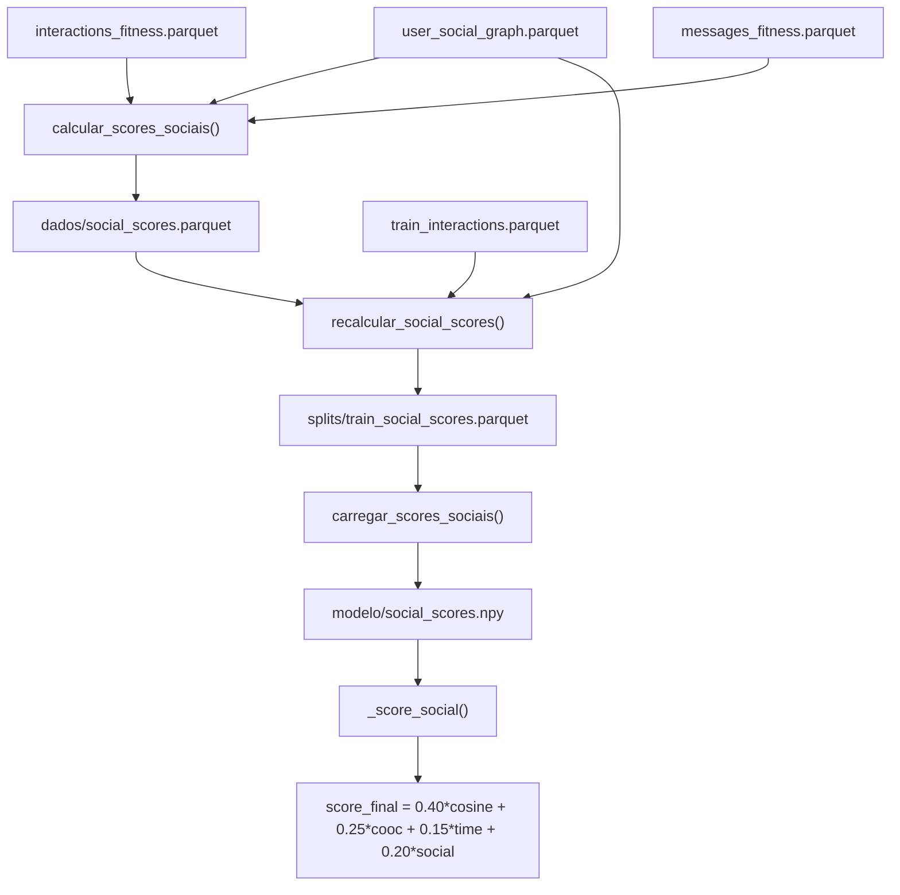

# Integrar Grafo Social como Sinal de Recomendação

## Contexto

O `user_social_graph.parquet` (colunas: `user_id`, `friend_id`, `since`) já é gerado pelo pipeline mas **não é usado** no modelo.
O `interactions_fitness.parquet` tem `user_id` e `message_id` — é a ponte entre grafo e posts.

## Lógica do novo sinal: Social Influence Score

Para cada post:

1. Buscar quais usuários interagiram com ele (`interactions_fitness`)
2. Somar o **grau** (número de conexões) de cada um desses usuários no grafo social
3. Normalizar para [0, 1]

Posts interagidos por usuários altamente conectados (influenciadores) recebem score mais alto.

## Novos pesos do score híbrido

| Sinal             | Antes | Depois |
| ----------------- | ----- | ------ |
| Cosine similarity | 0.50  | 0.40   |
| Co-ocorrência     | 0.30  | 0.25   |
| Time decay        | 0.20  | 0.15   |
| Social influence  | —     | 0.20   |

## Fluxo dos novos artefatos

## Mudanças por arquivo

### `[treinamento/preparacao_dados.py](treinamento/preparacao_dados.py)`

- Nova função `calcular_scores_sociais(messages, interactions, social_graph)`:
  - Computa `degree_map = {user_id: grau}` do grafo (conta aparições em `user_id` + `friend_id`)
  - Para cada `message_id` em `messages`, soma graus dos usuários que interagiram
  - Normaliza para [0,1] e retorna `DataFrame` com índice `post_idx`
- Salva `dados/social_scores.parquet`
- Chamada adicionada em `main()` com fallback gracioso se grafo não existir

### `[treinamento/dividir_dataset.py](treinamento/dividir_dataset.py)`

- Carrega `user_social_graph.parquet` de `OUTPUT_DIR`
- Nova função `recalcular_social_scores(train_df, train_interactions, social_graph)`:
  - Usa `_message_id` (já disponível no `train_df`) para filtrar interações do treino
  - Mesma lógica de grau, alinhada ao índice do split (0 a n_treino-1)
- Salva `splits/train_social_scores.parquet`
- Segue exatamente o padrão de `recalcular_cooccurrence()`

### `[treinamento/treinar.py](treinamento/treinar.py)`

- Nova função `carregar_scores_sociais(posts, usar_split)`:
  - Se `usar_split=True`: carrega `splits/train_social_scores.parquet`
  - Senão: carrega `dados/social_scores.parquet`
  - Alinha pelo índice do posts, preenche ausentes com 0
  - Retorna `np.ndarray shape (n_posts,)`
- Atualiza `salvar_artefatos()` para incluir `social_scores.npy`
- Adiciona chamada + log no `main()`

### `[treinamento/recomendar.py](treinamento/recomendar.py)`

- Em `__init_`_: adiciona `self._social_scores: np.ndarray | None = None`
- Em `carregar()`: tenta carregar `social_scores.npy` (não obrigatório; fallback para zeros)
- Nova constante `PESO_SOCIAL = 0.20` e ajuste das demais
- Novo método `_score_social()`: retorna `self._social_scores` diretamente (já normalizado)
- Atualiza `recomendar()`: `score_final = PESO_COSINE*sc + PESO_COOC*si + PESO_TIME*st + PESO_SOCIAL*ss`
- Atualiza docstring do módulo

### `[treinamento/README.md](treinamento/README.md)` e `[README.md](README.md)`

- Atualiza tabela de pesos dos sinais (4 sinais)
- Documenta `social_scores.npy` e `train_social_scores.parquet` como novos artefatos

