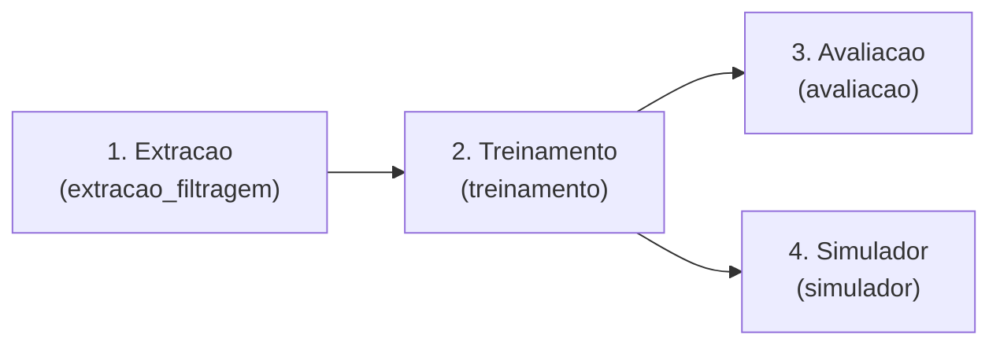

# IA Recomendação Rede Social Fitness

Pipeline de extração e filtragem do LDBC SNB Interactive v1 para conteúdo fitness (treinos, academia, corrida).

## Entendendo o projeto (para leigos)

> Esta seção explica, em linguagem bem simples, **o que este projeto é e como ele funciona como um todo** — sem exigir que você saiba programar. Cada módulo tem, no seu próprio README, uma seção "Explicação dos códigos (para leigos)" e um glossário detalhado. Aqui damos a visão geral e, ao final do arquivo, um **Glossário-mestre** com os termos que aparecem em todo lugar.

### O que é um sistema de recomendação?

É a tecnologia que **sugere coisas para você**. Quando a Netflix indica um filme, o Spotify monta uma playlist ou uma loja mostra "quem comprou isto também levou aquilo", há um sistema de recomendação por trás. Este projeto é exatamente isso, mas para **posts de uma rede social fitness**: dado um tema (tags como "corrida", "musculação") e um momento no tempo, ele sugere os posts mais relevantes.

Uma observação importante: este projeto **não usa "IA generativa" nem redes neurais gigantes**. Ele é um **recomendador clássico**, que combina estatísticas e regras claras. Isso o torna **rápido, explicável** (dá para entender por que cada post foi sugerido) e **determinístico** (a mesma pergunta dá sempre a mesma resposta).

### De onde vêm os dados?

Como não seria ético usar dados reais de pessoas, o projeto usa o **LDBC SNB**, uma **rede social fictícia** (gerada por computador para pesquisa), com posts, curtidas e amizades realistas. Filtramos dela apenas o conteúdo **fitness**.

### O fluxo completo, em quatro etapas

Pense numa **linha de produção** que vai do dado bruto até a recomendação pronta:



1. **Extração** ([extracao_filtragem/README.md](extracao_filtragem/README.md)): abre a "caixa" gigante de dados brutos e **separa só o conteúdo fitness**, organizando em arquivos limpos.
2. **Treinamento** ([treinamento/README.md](treinamento/README.md)): usa esses arquivos para **construir o cérebro recomendador** (calcula as "pistas" e monta os modelos).
3. **Avaliação** ([avaliacao/README.md](avaliacao/README.md)): aplica uma "**prova**" no recomendador para **medir o quanto ele acerta**, com notas objetivas.
4. **Simulador** ([simulador/README.md](simulador/README.md)): uma **página web** onde você escolhe tags e vê as recomendações na prática.

### Os dois "ingredientes" centrais que aparecem o tempo todo

- **Tag:** uma **etiqueta de assunto** colada a um post (como uma hashtag: `#corrida`). É assim que o sistema sabe do que cada post fala.
- **Timestamp:** o **momento no tempo** (uma data convertida em número), usado para dar preferência a conteúdo mais próximo da data de referência.

## Dataset necessário

O pipeline requer o **snapshot completo** do LDBC SNB (Tag, TagClass, Post, Comment, etc.).  
O arquivo `social_network-sf30-numpart-8.tar.zst` contém apenas update streams e **não funciona**.

Use um dos datasets completos do [SURF/CWI](https://repository.surfsara.nl/community/cwi):
- `social_network-sf30-CsvBasic-LongDateFormatter.tar.zst`
- `social_network-csv-basic-sf30.tar.zst`

## Estrutura

```
├── main.py                      # Orquestrador interativo do pipeline
├── casos_uso_tcc.json           # Configuração raiz do benchmark multi-modelo
├── avaliacao/                   # Avaliações e benchmark
│   ├── benchmark_modelos.py     # Runner multi-modelo do TCC
│   └── resultados/              # Relatórios e comparativos (gerado)
├── extracao_filtragem/          # Extração e filtragem
│   ├── dataset/                 # Dataset bruto (.tar.zst)
│   ├── download_dataset.py      # Script de download
│   ├── pipeline.py              # Script principal
│   ├── ldbc_snb/                # Staging extraído por dataset_key
│   │   └── <dataset_key>/
│   └── output/                  # Parquets gerados por dataset_key
│       └── <dataset_key>/
│           ├── dataset_manifest.json
│           ├── interactions_fitness.parquet
│           ├── messages_fitness.parquet
│           ├── tags_fitness.parquet
│           ├── user_interests_fitness.parquet
│           ├── user_social_graph.parquet
│           └── tag_cooccurrence.parquet
└── treinamento/                # IA de recomendação
    ├── preparacao_dados.py      # Feature engineering a partir dos parquets
    ├── treinar.py               # Treina e serializa os artefatos do modelo
    ├── preparar_dataset_ltr.py  # Monta datasets query-item para LTR
    ├── treinar_ltr.py           # Treina o LightGBMRanker
    ├── recomendar.py            # Inferência — função recomendar() + CLI
    ├── rankers.py               # Abstração plugável de rankers
    ├── dados/                   # Artefatos intermediários por dataset_key
    │   └── <dataset_key>/
    │       ├── dataset_manifest.json
    │       ├── posts_metadata.parquet
    │       ├── interacoes_por_tag.parquet
    │       ├── social_scores.parquet
    │       ├── user_tag_profile.parquet
    │       └── splits/
    │           ├── dataset_manifest.json
    │           ├── train_posts.parquet
    │           ├── val_posts.parquet
    │           └── test_posts.parquet
    ├── modelo/                  # Modelo padrão/legado (compatibilidade)
    └── modelos/                 # Modelos por dataset_key/experimento (gerado)
        └── <dataset_key>/
```

## Pré-requisitos

- Python 3.11+
- zstd (Linux: `apt install zstd`; Windows: [releases](https://github.com/facebook/zstd/releases))
- tar (Windows 10+ inclui)

### Ambiente Anaconda

Recomenda-se usar um ambiente dedicado para o projeto. No Windows, prefira executar os comandos em um `Anaconda Prompt`.

```bash
conda create -n ia-recomendacao-fitness python=3.11 -y
conda activate ia-recomendacao-fitness
python -m pip install --upgrade pip
python -m pip install -r requirements.txt
```

Para remover o ambiente por completo e recriá-lo do zero:

```bash
conda env remove -n ia-recomendacao-fitness
```

Para confirmar que o terminal está usando o ambiente correto:

```bash
python --version
python -c "import sys; print(sys.executable)"
```

Com o ambiente ativado, o fluxo completo do projeto pode ser executado por esse mesmo terminal, incluindo `python main.py` e os scripts de `extracao_filtragem/`, `treinamento/` e `avaliacao/`.

## Orquestrador Interativo

Fluxo recomendado a partir da raiz do projeto:

```bash
python main.py
```

O `main.py` oferece um menu para:

- selecionar um dataset já baixado
- baixar um novo dataset e ativá-lo
- selecionar o modelo/experimento alvo
- rodar extração
- rodar treinamento
- rodar avaliação
- rodar casos de uso do TCC
- rodar extração + treinamento + avaliação
- rodar treinamento + avaliação
- visualizar o estado atual salvo

O contexto fica persistido em `.pipeline_state.json`, incluindo dataset ativo,
artefatos detectados no disco, alvo de modelo/experimento, escopo do benchmark
TCC e o histórico das últimas execuções por etapa.

No fluxo interativo:

- o dataset ativo define um `dataset_key` canônico e, com isso, todos os paths efetivos de extração, dados, splits, modelos e resultados
- o alvo pode ser o modelo padrão do namespace ativo (`treinamento/modelos/<dataset_key>/modelo_padrao/`) ou um experimento de `casos_uso_tcc.json`
- treino e avaliação passam a respeitar o `model_dir` do alvo selecionado
- avaliações de `popularidade` e `otimização` só aparecem como compatíveis para a família baseline
- se o dataset selecionado estiver ausente localmente, o `main.py` tenta baixá-lo automaticamente pelo `scale_factor` salvo
- o benchmark TCC pode rodar todos os modelos habilitados ou apenas um subconjunto escolhido no menu
- o orquestrador bloqueia reutilização silenciosa de artefatos quando a proveniência do dataset diverge do dataset ativo

## Namespaces por Dataset

O projeto agora isola os artefatos por `dataset_key`, derivado do nome do
arquivo selecionado, por exemplo:

- `social_network-sf1-CsvBasic-LongDateFormatter.tar.zst` -> `social_network-sf1-CsvBasic-LongDateFormatter`
- `social_network-sf30-CsvBasic-LongDateFormatter.tar.zst` -> `social_network-sf30-CsvBasic-LongDateFormatter`

Com isso, o mesmo workspace pode manter extrações, dados, splits, modelos e
resultados de múltiplos datasets ao mesmo tempo, sem precisar apagar diretórios
anteriores.

### Layout novo

- `extracao_filtragem/ldbc_snb/<dataset_key>/`
- `extracao_filtragem/output/<dataset_key>/`
- `treinamento/dados/<dataset_key>/`
- `treinamento/dados/<dataset_key>/splits/`
- `treinamento/modelos/<dataset_key>/<model_id>/`
- `avaliacao/resultados/<dataset_key>/`

### Proveniência forte

- `output/<dataset_key>/dataset_manifest.json` registra o dataset bruto e o resumo da extração
- `dados/<dataset_key>/dataset_manifest.json` registra a preparação de dados
- `dados/<dataset_key>/splits/dataset_manifest.json` registra o split usado
- cada `metadata.json` de modelo passa a gravar `dataset_key`, `dataset_path`, `scale_factor` e os diretórios efetivamente usados no treino

### Compatibilidade com artefatos legados

Os caminhos antigos e globais, como `extracao_filtragem/output/`,
`treinamento/dados/` e `treinamento/modelo/`, continuam existindo apenas como
camada de compatibilidade/diagnóstico. No fluxo novo, o `main.py` prioriza
sempre o namespace do dataset ativo e não reutiliza artefatos globais sem
proveniência compatível.

## Execução Manual

### 1. Baixar o dataset

```bash
pip install -r requirements.txt
python extracao_filtragem/download_dataset.py --scale-factor sf0.1
```

Scale factors: `sf0.1` (~18 MB), `sf0.3`, `sf1`, `sf3`, `sf10`, `sf30` (~20 GB).

### 2. Rodar o pipeline

```bash
python extracao_filtragem/pipeline.py --dataset-path extracao_filtragem/dataset/social_network-sf0.1-CsvBasic-LongDateFormatter.tar.zst --dataset-key social_network-sf0.1-CsvBasic-LongDateFormatter
```

Ou, se o dataset estiver no caminho padrão após o download:

```bash
python extracao_filtragem/pipeline.py
```

### Dataset personalizado

```bash
python extracao_filtragem/pipeline.py --dataset-path caminho/para/arquivo.tar.zst
```

Ou via variável de ambiente:

```bash
export LDBC_DATASET_PATH=caminho/para/arquivo.tar.zst
python extracao_filtragem/pipeline.py
```

## Treinamento da IA de Recomendação

### 1. Preparar os dados

```bash
python treinamento/preparacao_dados.py --dataset-key social_network-sf0.1-CsvBasic-LongDateFormatter
```

Lê os parquets de `extracao_filtragem/output/<dataset_key>/` e gera artefatos
intermediários em `treinamento/dados/<dataset_key>/`, incluindo
`social_scores.parquet` e `user_tag_profile.parquet`.

### 2. Dividir o dataset

```bash
python treinamento/dividir_dataset.py --dataset-key social_network-sf0.1-CsvBasic-LongDateFormatter
```

Divide os posts em treino (70%), validação (15%) e teste (15%). Recalcula co-ocorrência e scores sociais usando apenas dados de treino.

### 3. Treinar o modelo

```bash
python treinamento/treinar.py --dataset-key social_network-sf0.1-CsvBasic-LongDateFormatter --dataset-path extracao_filtragem/dataset/social_network-sf0.1-CsvBasic-LongDateFormatter.tar.zst
```

Ajusta o `MultiLabelBinarizer` sobre os nomes das tags, computa a matriz de
posts e serializa os artefatos no `model_dir` escolhido, gravando também a
proveniência do dataset no `metadata.json`.

Para os experimentos do TCC, existe o modo com catálogo completo e estatísticas
calculadas só no split de treino:

```bash
python treinamento/treinar.py --catalogo-completo --dataset-key social_network-sf0.1-CsvBasic-LongDateFormatter --model-dir treinamento/modelos/social_network-sf0.1-CsvBasic-LongDateFormatter/baseline_hibrido_padrao
```

### 3A. Benchmark multi-modelo com LTR

```bash
python avaliacao/benchmark_modelos.py --config casos_uso_tcc.json --dataset-key social_network-sf0.1-CsvBasic-LongDateFormatter --dataset-path extracao_filtragem/dataset/social_network-sf0.1-CsvBasic-LongDateFormatter.tar.zst
```

Esse fluxo lê `casos_uso_tcc.json`, treina múltiplos modelos baseline e LTR,
sintetiza cada experimento em `treinamento/modelos/<dataset_key>/<model_id>/` e gera o comparativo
consolidado em:

- `avaliacao/resultados/<dataset_key>/benchmark_modelos.csv`
- `avaliacao/resultados/<dataset_key>/benchmark_modelos.md`
- `avaliacao/resultados/<dataset_key>/benchmark_modelos.json`

Pelo `main.py`, o benchmark também pode ser parametrizado para executar:

- todos os modelos habilitados em `casos_uso_tcc.json`
- apenas um subconjunto de `model_id`s selecionado interativamente

### 4. Recomendar posts (CLI)

```bash
# Listar todas as tags conhecidas pelo modelo
python treinamento/recomendar.py --listar-tags

# Recomendar posts por tags e timestamp
python treinamento/recomendar.py --tags "Born_to_Run,Superunknown" --timestamp 1320000000000

# Recomendar de forma personalizada para um usuário
python treinamento/recomendar.py --tags "Born_to_Run,Superunknown" --timestamp 1320000000000 --user-id 123

# Top 5 posts mais próximos no tempo e por tags (personalizado)
python treinamento/recomendar.py --tags "Running_Free" --timestamp 1300000000000 --top-k 5 --user-id 123

# Ajustar o peso da popularidade no score padrão/fallback
python treinamento/recomendar.py --tags "Running_Free" --timestamp 1300000000000 --peso-popularidade 0.20
```

### 5. Recomendar via Python


```python
from treinamento.recomendar import recomendar

df = recomendar(
    tags=["Born_to_Run", "Superunknown"],
    timestamp=1320000000000,
    top_k=10,
    user_id=123,
)
print(df)
```

### 6. Avaliar impacto da popularidade (antes/depois)

```bash
# Avaliação real (quando houver artefatos de treino + splits)
python avaliacao/avaliar_popularidade.py --k 10 --peso-depois 0.10

# Avaliação demo (fallback sem dataset local)
python avaliacao/avaliar_popularidade.py --demo --k 10 --peso-depois 0.10
```

### Arquitetura do modelo

O score de relevância combina cinco sinais no modo padrão e cinco no modo
personalizado (`user_id` informado com perfil disponível). No modo personalizado,
a afinidade usuário-item substitui o sinal de popularidade.

| Sinal | Peso (padrão) | Peso (personalizado) | Descrição |
|---|---|---|---|
| Similaridade de conteúdo | 0.40 | 0.30 | Coseno entre vetores de tags (MultiLabelBinarizer) |
| Co-ocorrência de tags | 0.25 | 0.20 | Boost para tags relacionadas que também aparecem no post |
| Recência relativa | 0.15 | 0.15 | Decaimento exponencial pela distância em dias ao timestamp de entrada |
| Influência social | 0.20 | 0.15 | Soma do grau dos usuários que interagiram com o post no grafo social |
| Popularidade de tags | 0.10 (configurável) | - | Volume histórico de interações das tags do post (`popularidade.npy`) |
| Afinidade usuário-item | - | 0.20 | Perfil do usuário com interesses explícitos, interações recentes e sinais sociais dos vizinhos |

**Entradas:**
- `tags: List[str]` — nomes das tags (valores, não IDs)
- `timestamp: int` — timestamp em milissegundos
- `peso_popularidade: float` — ajusta o sinal de popularidade no score padrão/fallback
- `user_id: Optional[int]` — ativa recomendação personalizada quando houver perfil do usuário; caso contrário, usa o score padrão

**Saídas** (sem IDs):

| Coluna | Descrição |
|---|---|
| `message_type` | `post` ou `comment` |
| `creation_date_iso` | Data de criação (ISO 8601) |
| `tags_fitness` | Lista de tags fitness do post recomendado |
| `content_length` | Tamanho do conteúdo em caracteres |
| `language` | Idioma detectado |
| `relevance_score` | Score combinado normalizado [0, 1] |

---

## Saídas (`extracao_filtragem/output/<dataset_key>/`)

### Arquivos principais

| Arquivo | Colunas | Descrição |
|---|---|---|
| `interactions_fitness.parquet` | `user_id`, `message_id`, `event_type`, `timestamp`, `tags_fitness` | Todas as interações (like, create, reply) de usuários com conteúdo fitness |
| `messages_fitness.parquet` | `message_id`, `message_type`, `creation_date`, `content_length`, `language`, `forum_id`, `tags_fitness` | Posts e comments com pelo menos 1 tag fitness, enriquecidos com metadados de conteúdo |
| `tags_fitness.parquet` | `tag_id`, `tag_name` | Catálogo de tags fitness detectadas no dataset |

### Arquivos para treinamento da IA de recomendação

| Arquivo | Colunas | Uso na IA |
|---|---|---|
| `user_interests_fitness.parquet` | `user_id`, `tag_id`, `tag_name` | Perfil de interesse declarado do usuário — recomendação content-based ("usuário segue essa tag → mostrar posts com essa tag") |
| `user_social_graph.parquet` | `user_id`, `friend_id`, `since` | Grafo de amizades filtrado para usuários ativos em fitness — recomendação colaborativa social ("amigos de quem curtiu também curtiram") |
| `tag_cooccurrence.parquet` | `tag_a`, `tag_b`, `cooccurrences` | Co-ocorrência de tags nos mesmos posts/comments — recomendação por similaridade de tags ("quem gosta de A possivelmente gosta de B") |

---

## Glossário-mestre (termos que aparecem em todo o projeto)

> Glossário consolidado dos termos **transversais** (que aparecem em vários módulos), explicados para quem não programa. Para listas mais completas e específicas, veja os glossários de cada módulo: [extração](extracao_filtragem/README.md#glossário-de-termos-extração), [treinamento](treinamento/README.md#glossário-de-termos-treinamento) e [avaliação](avaliacao/README.md#glossário-de-termos-avaliação).

### Dados e arquivos

- **Dataset:** o **conjunto de dados** usado. Aqui, uma rede social **fictícia** (LDBC SNB) gerada para pesquisa.
- **LDBC SNB:** o nome dessa rede social de mentira (um *benchmark*, ou padrão de comparação, de redes sociais).
- **Scale factor (fator de escala):** o **tamanho** do dataset, de `sf0.1` (minúsculo, para testes) a `sf30` (enorme).
- **CSV:** uma **planilha em texto puro**, simples mas sem otimização.
- **Parquet:** uma **planilha compacta e rápida** de ler (formato dos arquivos de trabalho do projeto).
- **Tag:** uma **etiqueta de assunto** (hashtag) colada a um post.
- **Timestamp:** um **momento no tempo** representado como número (milissegundos).
- **Manifesto / proveniência:** a **"nota fiscal" dos dados** — registra de onde vieram e como foram gerados, para garantir confiança e reprodutibilidade.
- **Namespace (dataset_key):** uma **"gaveta" separada por dataset**, para que vários datasets convivam no projeto sem se misturar.

### Conceitos de recomendação

- **Sistema de recomendação:** tecnologia que **sugere itens** relevantes (como Netflix/Spotify).
- **Interação:** uma **ação de uma pessoa com um conteúdo** (curtir, criar, responder).
- **Co-ocorrência:** duas tags que **aparecem juntas** com frequência (sinal de temas relacionados).
- **Grafo social:** o **mapa de amizades** (quem conhece quem).
- **Score / relevância:** a **nota** (de 0 a 1) que indica o quanto um post é recomendado.
- **Ranker (recomendador):** o **motor que ordena** os posts do mais para o menos relevante.
- **Personalizado:** quando a recomendação leva em conta **os gostos de um usuário específico**.

### Treino e modelos

- **Feature (pista):** um **número que descreve** o quão bom é um candidato (similaridade, recência...).
- **Split (treino/validação/teste):** a **divisão** dos dados em "estudo", "simulado" e "prova", para avaliar com honestidade.
- **Seed:** um número que **fixa a aleatoriedade**, garantindo que tudo se repita igual (reprodutibilidade).
- **Vazamento de dados (leakage):** quando o modelo **"cola"** usando informação da prova durante o estudo — inflaria os resultados.
- **Baseline:** o modelo **simples de referência**, usado para comparação.
- **LTR (Learning to Rank):** abordagem em que o modelo **aprende sozinho a ordenar**, em vez de usar pesos definidos à mão.
- **OOV (fora do vocabulário):** uma tag que o modelo **nunca viu** e, por isso, não sabe pontuar.

### Avaliação

- **Gabarito (ground truth):** as **respostas certas** (o que a pessoa realmente fez depois).
- **@K / Top-K:** considerar apenas os **K primeiros** itens recomendados.
- **Precision / Recall / NDCG / etc.:** diferentes **notas de acerto** das recomendações (detalhadas no [README de avaliação](avaliacao/README.md#entendendo-as-métricas-com-exemplos)).
- **Latência:** o **tempo de resposta** do modelo.
- **Benchmark:** uma **comparação padronizada** entre vários modelos ("campeonato").
