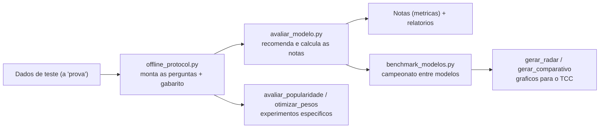

# Avaliação do Sistema de Recomendação

Este diretório reúne cinco frentes complementares:

- avaliação offline do recomendador no split de teste
- avaliação automática do impacto do sinal de popularidade
- avaliação manual reproduzível para análise qualitativa
- otimização de pesos do score híbrido
- benchmark multi-modelo do TCC

## Orquestrador interativo

Também é possível disparar as avaliações a partir da raiz do projeto:

```bash
python main.py
```

No menu, escolha `Rodar avaliacao`, `Rodar treinamento + avaliacao`,
`Rodar extracao + treinamento + avaliacao` ou `Casos de uso do TCC`. O submenu
de avaliação permite executar a avaliação offline, a análise de popularidade, a
avaliação manual e a otimização de pesos, enquanto a opção de TCC dispara o
benchmark multi-modelo a partir de `casos_uso_tcc.json`.

O fluxo interativo agora também persiste:

- o dataset ativo e o `scale_factor` para auto-download quando o arquivo não estiver disponível
- o `dataset_key` canônico derivado do dataset ativo
- o alvo de modelo/experimento selecionado (`treinamento/modelos/<dataset_key>/modelo_padrao` ou `treinamento/modelos/<dataset_key>/<model_id>`)
- o subconjunto de `model_id`s escolhido para o benchmark TCC

Com isso, a avaliação deixa de depender implicitamente de `treinamento/modelo`:

- `offline` e `manual` usam o `model_dir` do alvo atual
- `popularidade` e `otimização` só ficam disponíveis para a família `baseline_hibrido`
- os scripts inferem `splits` e `output` corretos a partir do `metadata.json` do modelo
- resultados são gravados em `avaliacao/resultados/<dataset_key>/...`

## Namespaces e proveniência

As avaliações agora seguem o mesmo namespace do dataset ativo:

- `treinamento/modelos/<dataset_key>/<model_id>/`
- `treinamento/dados/<dataset_key>/splits/`
- `avaliacao/resultados/<dataset_key>/`

Cada modelo gravado por `treinar.py` registra no `metadata.json`:

- `dataset_key`
- `dataset_path`
- `scale_factor`
- `output_dir`, `dados_dir` e `splits_dir` realmente usados

Com isso, `avaliar_modelo.py`, `avaliar_popularidade.py`,
`otimizar_pesos.py` e `preparar_dataset_ltr.py` conseguem localizar o dataset
certo sem depender de paths globais do workspace.

Artefatos globais antigos continuam sendo tratados apenas como compatibilidade
legada/diagnóstico. O fluxo novo não reutiliza silenciosamente um modelo ou
split cuja proveniência não bata com o dataset ativo.

## Scripts disponíveis

- `avaliacao/avaliar_modelo.py`: mede métricas de ranking e de negócio no split de teste
- `avaliacao/avaliar_popularidade.py`: compara o ranking antes/depois do peso de popularidade
- `avaliacao/avaliacao_manual.py`: executa cenários qualitativos reproduzíveis
- `avaliacao/otimizar_pesos.py`: busca pesos melhores para os quatro sinais base e grava `pesos_otimos.json` dentro do `model_dir` ativo
- `avaliacao/benchmark_modelos.py`: orquestra baseline e LTR, avalia todos e consolida a comparação do TCC

## Avaliação offline do recomendador

Executa a avaliação de qualquer ranker salvo em um `model_dir`, usando os dados
de teste do namespace do dataset do próprio modelo.

### Comando

```bash
python avaliacao/avaliar_modelo.py --k 5 10 20

# Avaliar um modelo específico do benchmark TCC
python avaliacao/avaliar_modelo.py --model-dir treinamento/modelos/social_network-sf1-CsvBasic-LongDateFormatter/ltr_lightgbm_v1 --out-dir avaliacao/resultados/social_network-sf1-CsvBasic-LongDateFormatter/modelos/ltr_lightgbm_v1/offline --k 5 10 20
```

O script grava resultados em `avaliacao/resultados/<dataset_key>/...` nos
formatos JSON, CSV e Markdown.

### Protocolo de avaliação

1. Carrega o split de teste (`test_interactions.parquet`).
2. Para cada usuário, ordena as interações por tempo.
3. Cada interação vira um item de referência.
4. O ground truth é o conjunto de interações futuras do mesmo usuário no teste.
5. Gera recomendações a partir das tags e do timestamp do item de referência.
6. Compara o Top-K recomendado com os itens futuros reais para calcular métricas.

### Métricas de ranking em K

- `Precision@K`: fração dos K recomendados que são relevantes
- `Recall@K`: fração dos relevantes recuperados no Top-K
- `HitRate@K`: 1 se houver ao menos um item relevante no Top-K; senão 0
- `MAP@K`: média da precisão acumulada nas posições com hit, normalizada por `min(|relevantes|, K)`
- `NDCG@K`: qualidade do ranqueamento considerando posição
- `MRR@K`: posição do primeiro item relevante recuperado

### Métricas de negócio/TCC

- cobertura de catálogo
- diversidade intra-lista por tags
- novidade baseada em popularidade inversa
- recência média recomendada em dias
- latência de inferência p50
- latência de inferência p95

### Arquivos gerados

- `avaliacao/resultados/<dataset_key>/.../metricas_resumo.json`
- `avaliacao/resultados/<dataset_key>/.../metricas_ranking_por_k.csv`
- `avaliacao/resultados/<dataset_key>/.../queries_avaliadas.csv`
- `avaliacao/resultados/<dataset_key>/.../resumo_avaliacao.md`

## Avaliação automática de popularidade

Compara o desempenho do ranking com e sem o sinal de popularidade.

### Comandos

```bash
# Modo real
python avaliacao/avaliar_popularidade.py --model-dir treinamento/modelos/social_network-sf1-CsvBasic-LongDateFormatter/modelo_padrao --k 10 --peso-depois 0.10

# Modo demo
python avaliacao/avaliar_popularidade.py --demo --k 10 --peso-depois 0.10
```

### Saída

Gera `avaliacao/resultados/<dataset_key>/.../metricas_antes_depois.json` com:

- `modo`: `real` ou `demo`
- `config`: configuração usada na execução
- `antes`: métricas com `peso_popularidade=0.0`
- `depois`: métricas com `peso_popularidade=<valor configurado>`
- `delta`: variação (`depois - antes`) para as métricas de ranking

## Avaliação manual reproduzível

Define um fluxo manual e reproduzível para validar qualitativamente as
recomendações.

### Arquivos

- `avaliacao/casos_manuais.yaml`: cenários com entradas e critérios esperados
- `avaliacao/avaliacao_manual.py`: executor dos cenários
- `avaliacao/resultados/avaliacao_manual.md`: relatório consolidado gerado automaticamente

### Como executar

```bash
python avaliacao/avaliacao_manual.py

# Avaliar um model_dir específico e salvar um resumo JSON
python avaliacao/avaliacao_manual.py --model-dir treinamento/modelos/social_network-sf1-CsvBasic-LongDateFormatter/ltr_lightgbm_v1 --saida-json avaliacao/resultados/social_network-sf1-CsvBasic-LongDateFormatter/modelos/ltr_lightgbm_v1/manual/avaliacao_manual.json
```

Opcionalmente:

```bash
python avaliacao/avaliacao_manual.py --casos avaliacao/casos_manuais.yaml --saida avaliacao/resultados/avaliacao_manual.md
```

### Estrutura dos cenários

Cada caso em `casos_manuais.yaml` define:

- entrada com `tags`, `timestamp`, `top_k` e `contexto_usuario`
- critérios de saída esperada para aderência temática, recência, variedade e ausência de itens irrelevantes

### Exemplo mínimo

```yaml
casos:
  - id: caso_exemplo
    titulo: "Exemplo"
    descricao: "Descrição do cenário"
    entrada:
      tags: ["Born_to_Run"]
      timestamp: 1320000000000
      top_k: 5
      contexto_usuario:
        perfil: "iniciante"
        objetivo: "corrida"
        restricoes: []
    criterios_saida:
      aderencia_tematica:
        esperado: "Maioria dos itens no tema"
        proporcao_minima: 0.8
      recencia:
        esperado: "Resultados próximos no tempo"
        max_delta_dias: 365
        proporcao_minima: 0.6
      variedade:
        esperado: "Diversidade de combinações"
        minimo_conjuntos_unicos: 3
      ausencia_itens_irrelevantes:
        esperado: "Sem itens fora de escopo"
        tags_bloqueadas: ["Politics"]
        proporcao_minima: 1.0
```

### Interpretação do relatório

Para cada caso, o markdown final traz:

- tabela com o Top-K retornado pelo modelo
- tabela de critérios qualitativos com esperado, observado e status
- conclusão geral com a quantidade de cenários aprovados integralmente

Se os artefatos de treino/modelo não estiverem disponíveis, o script registra o
erro no caso e ainda gera o relatório.

## Otimização de pesos

Executa grid search e, opcionalmente, random search para ajustar os pesos dos
quatro sinais base do score híbrido.

### Comando

```bash
python avaliacao/otimizar_pesos.py --model-dir treinamento/modelos/social_network-sf1-CsvBasic-LongDateFormatter/modelo_padrao --grid-step 0.1 --top-k 10 --max-queries 300
```

### Saídas

- `avaliacao/resultados/<dataset_key>/.../pesos_experimentos.csv`
- `<model_dir>/pesos_otimos.json`

## Benchmark multi-modelo do TCC

Executa o fluxo completo orientado a benchmark, lendo `casos_uso_tcc.json`,
treinando múltiplos modelos baseline e LTR, rodando as avaliações configuradas
e gerando uma tabela comparativa consolidada.

### Comando

```bash
python avaliacao/benchmark_modelos.py --config casos_uso_tcc.json --dataset-key social_network-sf1-CsvBasic-LongDateFormatter --dataset-path extracao_filtragem/dataset/social_network-sf1-CsvBasic-LongDateFormatter.tar.zst
```

### Saídas consolidadas

- `avaliacao/resultados/<dataset_key>/benchmark_modelos.csv`
- `avaliacao/resultados/<dataset_key>/benchmark_modelos.md`
- `avaliacao/resultados/<dataset_key>/benchmark_modelos.json`

### Colunas principais do comparativo

- `model_id`, `family`, `descricao`
- `metric_target`, `metric_target_value`
- `ndcg@k`, `map@k`, `recall@k`, `precision@k`, `hitrate@k`, `mrr@k`
- `catalog_coverage`, `diversity`, `novelty`, `avg_recency_days`
- `tempo_treinamento_s`, `latencia_p50_ms`, `latencia_p95_ms`, `artifact_size_mb`
- `dataset_key`, `split_seed`, `split_config`, `feature_set`, `params_resumidos`, `model_dir`

---

## Explicação dos códigos (para leigos)

> Esta seção explica, em linguagem simples, **o que cada programa de avaliação faz, como funciona e por que existe** — e, principalmente, **o que significa cada métrica**, com exemplos numéricos. A ideia é que mesmo quem não programa nem conhece estatística consiga entender. Os termos estão no **Glossário** ao final.

### A ideia geral em uma frase

Avaliar é como **aplicar uma prova no recomendador e corrigir**. Nós escondemos do modelo "o que a pessoa fez no futuro", pedimos para ele recomendar, e então **comparamos as recomendações com o que a pessoa realmente fez** (o gabarito). Quanto mais ele acerta — e mais no topo da lista —, melhor a nota.



---

### `offline_protocol.py` — monta as "perguntas" e o "gabarito"

**O que faz:** prepara as questões da prova. Para cada usuário, decide qual interação será a **pergunta de referência** e qual conjunto de interações **futuras** será o **gabarito** (as respostas certas).

**Como funciona:** lê os dados de teste, descobre qual **estratégia de divisão** foi usada (temporal, leave-last-k ou aleatória) e, respeitando o tempo, monta cada "questão": a partir do que a pessoa viu **antes**, o que ela deveria receber para acertar o que veio **depois**. Também marca os posts que a pessoa **já tinha visto** (para não recomendá-los de novo) e conta quantas questões foram descartadas e por quê.

**Por que usar:** garante que a prova seja **justa e padronizada**. Sem isso, cada avaliação mediria coisas diferentes e os resultados não seriam comparáveis.

---

### `avaliar_modelo.py` — aplica a prova e calcula as notas

**O que faz:** é a avaliação principal. Pega as questões do `offline_protocol`, pede recomendações ao modelo e **calcula todas as métricas** (notas de acerto, métricas de "negócio" e tempo de resposta).

**Como funciona, passo a passo:**

1. Para cada questão, pede ao modelo o **Top-K** (os K posts mais recomendados), excluindo os já vistos.
2. Compara o Top-K com o gabarito e calcula as métricas de ranking (Precision, Recall, etc. — explicadas adiante).
3. Calcula métricas de "negócio" (cobertura, diversidade, novidade, recência) e mede a **latência** (tempo de resposta).
4. Calcula um **intervalo de confiança** (margem de erro) para as médias, usando *bootstrap*.
5. Salva relatórios em JSON, CSV e Markdown.

**Por que usar:** é como o sistema ganha uma "nota objetiva". Permite dizer com números se um modelo é melhor que outro.

---

### `avaliar_popularidade.py` — testa o efeito de um "tempero"

**O que faz:** mede se **adicionar o sinal de popularidade** (dar um empurrãozinho para conteúdos mais movimentados) melhora ou piora as recomendações.

**Como funciona:** roda a avaliação **duas vezes** — uma **sem** popularidade (peso 0) e outra **com** o peso configurado (ex.: 0.10) — e mostra a **diferença** (*delta*) entre as duas. Tem um modo `--demo` que funciona sem dados reais, só para demonstração.

**Por que usar:** ajuda a decidir, com evidência, **quanto** de popularidade vale a pena usar — como provar a comida antes e depois de adicionar sal.

---

### `avaliacao_manual.py` — inspeção manual com "checklist"

**O que faz:** roda cenários escritos à mão (no arquivo `casos_manuais.yaml`) e verifica, com um **checklist qualitativo**, se as recomendações fazem sentido.

**Como funciona:** para cada caso (ex.: "alguém interessado em corrida"), pede as recomendações e confere quatro critérios: **aderência ao tema**, **recência**, **variedade** e **ausência de itens fora de assunto**. Gera um relatório dizendo o que era esperado, o que foi observado e se passou.

**Por que usar:** números não contam tudo. Esta avaliação é o **olhar humano** — confirma que os resultados são coerentes na prática, não só "bons no papel".

---

### `otimizar_pesos.py` — procura a melhor "receita" de pesos

**O que faz:** testa muitas combinações de pesos dos quatro sinais base (conteúdo, co-ocorrência, tempo, social) para achar a que dá a melhor nota.

**Como funciona:** faz uma **busca em grade** (*grid search*) — experimenta sistematicamente combinações de pesos (ex.: de 0,1 em 0,1, sempre somando 1) — e, opcionalmente, um refino aleatório (*random search*) perto das melhores. Mede cada combinação pela métrica NDCG na validação e salva a melhor receita em `pesos_otimos.json`.

**Por que usar:** em vez de chutarmos os pesos, deixamos o computador **testar e escolher** os melhores, de forma objetiva.

---

### `benchmark_modelos.py` — o "campeonato" entre modelos

**O que faz:** é o orquestrador do TCC. Lê a lista de experimentos (`casos_uso_tcc.json`), **treina vários modelos** (baseline, LTR, popularidade), **avalia todos** e monta uma **tabela comparativa** única.

**Como funciona:** para cada modelo habilitado, prepara os dados, treina, roda as avaliações configuradas e junta tudo (notas de ranking, métricas de negócio, tempo de treino, tamanho do modelo) num só comparativo (CSV, JSON e Markdown).

**Por que usar:** permite comparar **lado a lado**, de forma reproduzível, qual abordagem é melhor — o coração das conclusões do trabalho.

---

### `gerar_radar_modelos.py` e `gerar_comparativo_barras.py` — os gráficos do artigo

**O que fazem:** transformam os números do benchmark em **figuras** para o artigo do TCC.

**Como funcionam:** colocam várias métricas numa **escala comparável de 0 a 1** (sendo que recência e latência são "invertidas", pois aí **menor é melhor**) e desenham: um **gráfico de radar** (teia, bom para ver o "formato" de cada modelo) e um **gráfico de barras** (bom para comparar valor a valor). Salvam em PNG/PDF.

**Por que usar:** uma imagem comunica as diferenças entre modelos muito mais rápido que uma tabela cheia de números.

---

## Entendendo as métricas (com exemplos)

As métricas medem coisas diferentes. Vamos usar **um exemplo único** para todas as métricas de ranking:

> O sistema recomendou **5 posts** (K = 5), nesta ordem: **[A, B, C, D, E]**.
> O que a pessoa **realmente** consumiu depois (o **gabarito**, ou *relevantes*) foi: **{B, E, F}** (3 itens).
> Logo, dentro do Top-5 houve **2 acertos**: **B** (posição 2) e **E** (posição 5). O item F era relevante mas não foi recomendado.

### Métricas de ranking (medem acerto)

- **Precision@K (precisão):** "dos K que recomendei, quantos estavam certos?" → `acertos ÷ K`. No exemplo: `2 ÷ 5 = 0,40`. Pune recomendar lixo junto.

- **Recall@K (cobertura/revocação):** "dos itens certos que existiam, quantos consegui recuperar?" → `acertos ÷ total de relevantes`. No exemplo: `2 ÷ 3 = 0,67`. Pune deixar bons itens de fora.

- **HitRate@K (taxa de acerto):** "acertei **pelo menos um**?" → 1 (sim) ou 0 (não). No exemplo: **1,0**. É a métrica mais "fácil" — só quer saber se a lista serviu para algo.

- **MRR@K (posição do primeiro acerto):** recompensa **acertar cedo**. Vale `1 ÷ posição do primeiro acerto`. No exemplo, o primeiro acerto (B) está na posição 2 → `1 ÷ 2 = 0,50`. Se estivesse na posição 1, seria 1,0.

- **MAP@K (precisão média):** olha a precisão **em cada ponto onde houve acerto** e tira a média. No exemplo: no 1º acerto (posição 2) a precisão acumulada é `1/2 = 0,5`; no 2º acerto (posição 5) é `2/5 = 0,4`; soma `0,9`, dividida por `min(3, 5) = 3` → **0,30**. Premia ter **muitos acertos e bem no topo**.

- **NDCG@K (qualidade do ranqueamento):** a mais completa. Dá mais valor a acertos **no topo** e desconta acertos em posições baixas (usando um desconto logarítmico), comparando com o ranking "perfeito" possível. Resultado entre 0 e 1. No exemplo, dá ≈ **0,48**. É a métrica-alvo principal do projeto, porque captura bem "acertou, e acertou cedo?".

> Resumindo o exemplo: Precision@5 = 0,40 · Recall@5 = 0,67 · HitRate@5 = 1,0 · MRR@5 = 0,50 · MAP@5 = 0,30 · NDCG@5 = 0,48.

### Métricas de negócio (medem qualidade além do acerto)

- **Cobertura de catálogo:** dos posts existentes, **quantos diferentes** o sistema chega a recomendar ao longo de todas as consultas. Ex.: recomendou 120 posts distintos de um catálogo de 600 → `0,20` (20%). Cobertura baixa = sempre os mesmos posts; alta = explora mais o acervo.

- **Diversidade intra-lista:** o quanto os itens **de uma mesma lista** são diferentes entre si (calculada como `1 − Jaccard` médio entre os pares de tags). Alta = lista variada; baixa = tudo muito parecido (cansativo).

- **Novidade (popularidade inversa):** o quanto o sistema recomenda itens **menos óbvios/populares**. Itens raros recebem novidade alta. Evita um recomendador que só sugere os "hits" de sempre.

- **Recência média (dias):** em média, **quão próximos no tempo** os posts recomendados estão da data de referência. Aqui, **valores menores são melhores** (conteúdo mais "atual" em relação à consulta).

- **Latência p50 e p95 (tempo de resposta, em milissegundos):** quanto o modelo demora para responder. **p50** é a **mediana** (metade das respostas é mais rápida que isso); **p95** é o "quase pior caso" (95% das respostas são mais rápidas que isso). Menor é melhor.

- **Intervalo de confiança (IC) 95% / bootstrap:** uma **margem de erro** para a média. Como nem sempre temos muitas consultas, o programa **reembaralha as notas mil vezes** (técnica chamada *bootstrap*) para estimar entre quais valores a média "verdadeira" provavelmente cai. Ex.: "NDCG@10 = 0,32 (IC 95%: 0,28–0,36)" significa "muito provavelmente o valor real está entre 0,28 e 0,36".

---

## Glossário de termos (avaliação)

Em ordem alfabética, com analogias simples.

- **@K (arroba K):** olhar **só os K primeiros** da lista de recomendações (ex.: @5 = os 5 do topo). Faz sentido porque o usuário raramente passa da primeira tela.
- **Baseline:** um modelo **simples de referência**, usado para comparar. Aqui, muitas vezes é a "popularidade pura".
- **Benchmark:** uma **comparação padronizada** entre vários modelos, nas mesmas condições — um "campeonato".
- **Bootstrap:** técnica que **reembaralha os dados muitas vezes** (sorteando com repetição) para estimar a margem de erro de uma média.
- **Cobertura de catálogo:** quantos **posts diferentes** o sistema recomenda no total (variedade global).
- **Delta:** a **diferença** entre dois valores (ex.: nota "depois" menos nota "antes").
- **Diversidade intra-lista:** o quanto os itens **de uma mesma lista** diferem entre si.
- **Gabarito (ground truth):** as **respostas certas** — o que o usuário realmente consumiu depois. É com isso que comparamos as recomendações.
- **Grid search (busca em grade):** testar **sistematicamente** muitas combinações (de pesos, por exemplo), como varrer todas as casas de um tabuleiro.
- **HitRate@K:** mede se houve **pelo menos um acerto** no Top-K (1 ou 0).
- **Intervalo de confiança (IC 95%):** a **faixa** em que a média verdadeira provavelmente está. Quanto mais estreita, mais confiável o resultado.
- **Jaccard:** medida de **semelhança entre conjuntos** = itens em comum ÷ itens totais distintos. Usada na diversidade.
- **Latência:** **tempo de resposta** do modelo (quanto demora para recomendar).
- **MAP@K (Mean Average Precision):** **precisão média** considerando as posições dos acertos — premia muitos acertos e bem no topo.
- **Mediana (p50):** o valor **do meio**: metade dos casos está abaixo, metade acima. Mais robusta que a média simples para tempos de resposta.
- **MRR@K (Mean Reciprocal Rank):** dá nota pela **posição do primeiro acerto** (acertar mais cedo vale mais).
- **NDCG@K:** mede a **qualidade da ordem** das recomendações, valorizando acertos no topo. É a métrica-alvo principal.
- **Novidade:** o quanto o sistema sugere itens **menos populares/óbvios**.
- **p50 / p95 (percentis):** "p95 = 95% dos casos são melhores (mais rápidos) que esse valor". Servem para resumir tempos sem se enganar com casos extremos.
- **Precision@K (precisão):** dos K recomendados, **quantos estavam certos**.
- **Random search (busca aleatória):** testar combinações **sorteadas** (em vez de varrer todas), útil para refinar perto das melhores.
- **Recall@K (revocação):** dos itens certos existentes, **quantos foram recuperados** no Top-K.
- **Recência:** **proximidade no tempo** entre o post recomendado e a data de referência (aqui, menor distância é melhor).
- **Split temporal:** dividir os dados respeitando o **tempo** (passado para treinar, futuro para testar), evitando que o modelo "veja o futuro".
- **Top-K:** a **lista dos K melhores** posts que o modelo recomendou.
