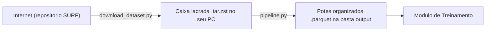

# Extração e Filtragem — LDBC SNB Fitness

Pipeline que extrai e filtra conteúdo fitness do dataset [LDBC SNB Interactive v1](https://ldbcouncil.org/benchmarks/snb-interactive/), gerando os parquets que alimentam a IA de recomendação.

## Estrutura

```
extracao_filtragem/
├── download_dataset.py     # Baixa o dataset do repositório SURF/CWI
├── pipeline.py             # Pipeline principal de extração e filtragem
├── dataset/                # Arquivo .tar.zst bruto (baixado pelo download_dataset.py)
├── ldbc_snb/               # CSVs extraídos do .tar.zst
│   └── social_network-*/
│       ├── dynamic/        # Dados dinâmicos (person, post, comment, likes, etc.)
│       └── static/         # Dados estáticos (tag, tagclass, organisation, place, etc.)
└── output/                 # Parquets gerados pelo pipeline.py
    ├── messages_fitness.parquet
    ├── tags_fitness.parquet
    ├── tag_cooccurrence.parquet
    ├── interactions_fitness.parquet
    ├── user_interests_fitness.parquet
    └── user_social_graph.parquet
```

## Pré-requisitos

```bash
pip install -r requirements.txt   # duckdb, pyarrow, requests
```

Além disso, é necessário ter disponível no sistema:
- **zstd** — descompressão do `.tar.zst` (Linux: `apt install zstd`; Windows: [github.com/facebook/zstd/releases](https://github.com/facebook/zstd/releases))
- **tar** — incluído no Windows 10+, Linux e macOS

## Orquestrador interativo

Opcionalmente, em vez de executar os scripts desta pasta manualmente, você pode
usar o orquestrador da raiz:

```bash
python main.py
```

No menu, escolha entre selecionar um dataset já baixado, baixar um novo dataset
e rodar a etapa de extração. O contexto atual fica salvo em
`.pipeline_state.json`, permitindo reutilizar o dataset ativo entre execuções.

## Como usar

### Passo 1 — Baixar o dataset

```bash
python extracao_filtragem/download_dataset.py --scale-factor sf0.1
```

| Scale Factor | Tamanho aprox. | Uso recomendado |
|---|---|---|
| `sf0.1` | ~18 MB | Desenvolvimento e testes |
| `sf0.3` | ~50 MB | Validação local |
| `sf1` | ~160 MB | Experimentos médios |
| `sf3` | ~500 MB | Treinamento real |
| `sf10` | ~1.7 GB | Produção |
| `sf30` | ~5 GB | Produção em larga escala |

O arquivo é salvo em `extracao_filtragem/dataset/`.

> **Nota:** o repositório SURF/CWI pode colocar arquivos grandes em "tape storage". O script detecta o HTTP 409 e dispara o staging automático, aguardando até o arquivo ficar disponível.

### Passo 2 — Rodar o pipeline

```bash
# Usa o dataset padrão (sf0.1 se já baixado)
python extracao_filtragem/pipeline.py

# Ou apontando explicitamente para o arquivo
python extracao_filtragem/pipeline.py --dataset-path extracao_filtragem/dataset/social_network-sf0.1-CsvBasic-LongDateFormatter.tar.zst
```

O pipeline extrai o `.tar.zst`, descobre os CSVs, carrega no DuckDB e filtra conteúdo fitness pelas palavras-chave das TagClasses e nomes de tags.

## O que o pipeline gera (`output/`)

### Parquets principais

| Arquivo | Colunas | Descrição |
|---|---|---|
| `messages_fitness.parquet` | `message_id`, `message_type`, `creation_date`, `content_length`, `language`, `forum_id`, `tags_fitness` | Posts e comments que contêm ao menos 1 tag fitness. `tags_fitness` é uma lista de nomes de tags. |
| `tags_fitness.parquet` | `tag_id`, `tag_name` | Catálogo de todas as tags fitness identificadas no dataset. |
| `interactions_fitness.parquet` | `user_id`, `message_id`, `event_type`, `timestamp`, `tags_fitness` | Todas as interações (like, create, reply) de usuários com conteúdo fitness. |

### Parquets para treinamento da IA

| Arquivo | Colunas | Papel na IA |
|---|---|---|
| `user_interests_fitness.parquet` | `user_id`, `tag_id`, `tag_name` | Interesses declarados do usuário — base para recomendação content-based |
| `user_social_graph.parquet` | `user_id`, `friend_id`, `since` | Grafo de amizades de usuários fitness — base para recomendação colaborativa social |
| `tag_cooccurrence.parquet` | `tag_a`, `tag_b`, `cooccurrences` | Tags que aparecem juntas nos mesmos posts — base para expandir recomendações ("quem curte A pode curtir B") |

## Como o pipeline identifica conteúdo fitness

O pipeline usa duas estratégias em sequência:

1. **Estratégia A — TagClass:** busca TagClasses cujo nome contenha palavras como `sports`, `health`, `fitness`, `running`, `exercise`, `gym`, `athletic`. Todas as tags filhas dessas classes são consideradas fitness.

2. **Estratégia B (fallback) — Nome da tag:** se a estratégia A não retornar resultados, filtra diretamente pelo nome da tag com palavras como `run`, `running`, `gym`, `workout`, `crossfit`, `hiit`, `cardio`, `weight`, `sport`, entre outras.

## Lendo os parquets

```python
import pandas as pd

msgs = pd.read_parquet("extracao_filtragem/output/messages_fitness.parquet")
print(msgs.head())

cooc = pd.read_parquet("extracao_filtragem/output/tag_cooccurrence.parquet")
print(cooc)
```

---

## Explicação dos códigos (para leigos)

> Esta seção explica, em linguagem bem simples, o que cada programa (arquivo terminado em `.py`) desta pasta faz, como ele funciona por dentro e por que ele existe. A ideia é que **qualquer pessoa**, mesmo sem saber programar, consiga entender. Cada termo técnico está explicado no **Glossário** logo abaixo.

### A ideia geral em uma frase

Pense nesta pasta como uma **cozinha industrial**. Chega uma **caixa gigante e lacrada** com TODOS os ingredientes de uma rede social inteira (milhões de posts, curtidas, amizades, sobre todos os assuntos possíveis). O trabalho desta cozinha é: abrir a caixa, **separar apenas os ingredientes "fitness"** (academia, corrida, treino) e organizá-los em **potes etiquetados e prontos para uso** — que depois serão usados pela parte de "Treinamento" para construir a inteligência que recomenda posts.

São só **dois programas** aqui:

1. `download_dataset.py` — vai até o "fornecedor" na internet e **traz a caixa gigante** para o seu computador.
2. `pipeline.py` — **abre a caixa, separa o que é fitness** e guarda nos potes organizados.



---

### `download_dataset.py` — o "entregador" que busca os dados

**O que faz (em uma frase):** baixa da internet o arquivo gigante com os dados brutos da rede social.

**Como funciona, passo a passo:**

1. Você escolhe o **tamanho** do arquivo que quer (o "scale factor" — veja o glossário). Por exemplo, `sf0.1` é pequeno (~18 MB, bom para testar) e `sf30` é enorme (~5 GB).
2. O programa monta o **endereço (link)** correto daquele arquivo no repositório oficial (um servidor de uma instituição holandesa de pesquisa, a SURF/CWI).
3. Ele tenta baixar. Aqui acontece um detalhe curioso: arquivos muito grandes ficam guardados numa **"fita" (tape storage)**, como num depósito distante. Quando isso ocorre, o servidor responde com um código de "ainda não está pronto" (o famoso **HTTP 409**). O programa então **pede educadamente para o servidor trazer o arquivo do depósito para a prateleira** (isso se chama *staging*), espera um tempo e tenta de novo.
4. Quando o arquivo fica disponível, o download acontece **em pedacinhos** (chamados *chunks*, de 1 MB cada) em vez de tudo de uma vez. Isso evita estourar a memória e permite mostrar a **barra de progresso** ("45%, 230 MB...").
5. Se a internet cair no meio, ele **tenta novamente** (até 5 vezes). Se você cancelar (Ctrl+C), ele apaga o arquivo pela metade para não deixar lixo.
6. No final, ele avisa qual é o **próximo passo**: rodar o `pipeline.py`.

**Por que usar:** o dataset é grande e fica num repositório que tem regras chatas (arquivos "na fita", links que mudam). Esse programa cuida de toda essa burocracia automaticamente, então você só diz o tamanho que quer e ele resolve o resto.

---

### `pipeline.py` — a "linha de produção" que separa o conteúdo fitness

**O que faz (em uma frase):** abre a caixa de dados brutos, encontra tudo que é relacionado a fitness e salva em arquivos organizados e prontos para a IA.

**Como funciona, passo a passo:**

1. **Abre a caixa lacrada.** O arquivo vem `.tar.zst` (uma caixa empacotada e "a vácuo"). O programa usa duas ferramentas do sistema, o `zstd` (tira o "vácuo"/descompacta) e o `tar` (abre a caixa), revelando dezenas de planilhas em formato **CSV** (tabelas de texto simples).

2. **Identifica cada planilha.** Há planilhas de tags, de posts, de comentários, de curtidas, de amizades, etc. O programa reconhece cada uma pelo nome do arquivo e descobre automaticamente detalhes como qual caractere separa as colunas (`|`, vírgula ou tabulação).

3. **Carrega tudo num "super Excel" temporário.** Ele usa o **DuckDB**, que é como uma calculadora de planilhas gigantes que vive só na memória (RAM) do computador. Isso permite fazer perguntas complexas ("quais posts têm tag de corrida?") muito rapidamente, sem precisar abrir nada manualmente.

4. **Decide o que é "fitness".** Esta é a parte mais inteligente, e ela usa **duas estratégias combinadas**:
   - **Por categoria (TagClass):** as tags são organizadas em categorias (ex.: a categoria "Sports" agrupa "Running", "Football"...). O programa procura categorias cujo nome contenha palavras como `sports`, `health`, `fitness`, `gym`. Se uma categoria é fitness, **todas as tags dela — e das suas subcategorias — entram**.
   - **Por nome da tag:** mesmo que a categoria não ajude, se o **nome da própria tag** contiver palavras como `run`, `workout`, `yoga`, `crossfit`, `weight`, ela também entra.
   - Para cada tag escolhida, ele **anota o motivo** da escolha (foi por categoria? por nome? pelos dois?) num relatório de **auditoria** (`fitness_tag_audit.json` e `.csv`). Isso deixa tudo transparente e conferível.

5. **Acha os posts e comentários fitness.** Qualquer post ou comentário que tenha **pelo menos uma** tag fitness é selecionado.

6. **Coleta as "interações".** Interação é qualquer ação de uma pessoa com um conteúdo. O programa junta três tipos:
   - **like** (curtida),
   - **create** (a pessoa que criou o post/comentário),
   - **reply** (comentário que é resposta a outro conteúdo).
   - Cada interação guarda quem fez, em qual conteúdo, que tipo foi e **quando** (a data é convertida para um número padronizado em milissegundos).

7. **Salva os "potes" organizados (arquivos `.parquet`).** Gera os seis arquivos descritos nas tabelas acima (mensagens, tags, interações, interesses, grafo social e co-ocorrência de tags). O formato **Parquet** é como uma planilha super-compacta e rápida de ler.

8. **Emite a "nota fiscal" dos dados (manifesto).** Por fim, grava um arquivo de **manifesto** com o resumo do que foi feito (quantas tags, quantos posts, de qual dataset vieram). Isso é a **proveniência**: a garantia de "de onde vieram esses dados e como foram gerados".

**Por que usar:** os dados brutos são imensos e bagunçados, misturando todos os assuntos. Este programa faz o trabalho pesado de **filtrar, limpar e organizar** só o que interessa (fitness), entregando arquivos pequenos, padronizados e confiáveis para a próxima etapa.

---

## Glossário de termos (extração)

Termos em ordem alfabética, explicados como se você nunca tivesse ouvido falar deles.

- **Auditoria (de tags):** um relatório que registra **cada tag escolhida e o porquê** dela ter sido considerada "fitness". Serve para transparência: qualquer um pode conferir as decisões.
- **Co-ocorrência (de tags):** quando duas tags aparecem **juntas no mesmo post**. Se "Corrida" e "Maratona" aparecem juntas com frequência, isso é um sinal de que quem gosta de uma provavelmente gosta da outra.
- **CSV:** uma planilha salva como **texto puro**, em que as colunas são separadas por um caractere (vírgula, `|` ou tabulação). É um formato simples e universal, mas "burro" (sem otimização).
- **Chunk (pedaço):** baixar/processar um arquivo **em fatias pequenas** em vez de tudo de uma vez, para não sobrecarregar a memória.
- **Dataset:** o **conjunto de dados** completo. Aqui é uma rede social **fictícia** (gerada por computador para pesquisa), com posts, curtidas e amizades realistas.
- **DuckDB:** uma espécie de **"Excel turbinado"** que roda dentro do programa, na memória do computador. Permite fazer perguntas (consultas) sobre tabelas gigantes de forma muito rápida. Como vive só na memória, some quando o programa termina.
- **Grafo social:** o **mapa de amizades** — quem é amigo de quem. "Grafo" é só o nome técnico para uma rede de pontos (pessoas) ligados por linhas (amizades).
- **HTTP 409:** uma resposta do servidor que, neste caso, significa **"o arquivo ainda não está pronto"** (porque está guardado na fita/depósito).
- **Interação:** qualquer **ação de uma pessoa com um conteúdo**. Aqui são três: *like* (curtir), *create* (criar) e *reply* (responder).
- **LDBC SNB:** o nome oficial do dataset. É um **benchmark** (padrão de comparação) de rede social criado pelo "Linked Data Benchmark Council". Pense numa "rede social de mentira", feita para testar sistemas.
- **Manifesto:** um arquivo-resumo que funciona como uma **"nota fiscal"** da etapa: registra o que foi gerado, quando e a partir de qual dataset.
- **Normalização (de texto):** **padronizar** o texto antes de comparar — tirar acentos, deixar tudo minúsculo, remover pontuação. Assim "Corrida", "corrida" e "CORRIDA" viram a mesma coisa.
- **Parquet:** um formato de arquivo de tabela **compacto e rápido**. Pense numa planilha "a vácuo", que ocupa pouco espaço e o computador lê muito depressa. É o formato dos "potes" de saída.
- **Pipeline:** **"linha de produção"**. Uma sequência de etapas em que a saída de uma alimenta a próxima.
- **Post / Comment / Person / Forum:** as "peças" da rede social — respectivamente **publicação**, **comentário**, **usuário** e **fórum/grupo** que contém publicações.
- **Proveniência:** a **origem e o histórico** dos dados — "de onde vieram e como foram produzidos". Importante para confiar nos resultados e reproduzi-los.
- **Scale factor (fator de escala):** o **tamanho** do dataset. Vai de `sf0.1` (minúsculo, para testes) até `sf30` (enorme). Quanto maior, mais realista e mais pesado.
- **Snapshot:** uma **"foto completa"** dos dados num dado momento (com tudo: tags, posts, etc.). É diferente dos *update streams*, que são só "atualizações" parciais e **não servem** para este projeto.
- **Staging / tape storage:** *tape storage* é guardar o arquivo numa **fita magnética** (depósito distante, lento). *Staging* é o processo de **pedir para trazer** esse arquivo do depósito para um local de acesso rápido antes de baixar.
- **Tag:** uma **etiqueta/hashtag** colada a um post (ex.: `#Running`). É como o conteúdo é classificado por assunto.
- **TagClass (categoria de tag):** uma **categoria que agrupa tags** parecidas (ex.: a categoria "Sports" contém "Running", "Football"...). As categorias formam uma hierarquia (categorias e subcategorias).
- **tar / zstd:** ferramentas para **abrir a "caixa" dos dados**. `tar` junta vários arquivos num só pacote; `zstd` comprime esse pacote para ocupar menos espaço. Juntos formam o `.tar.zst`.
- **Token:** uma **palavra isolada** depois que o texto foi quebrado em pedaços. Usado para comparar nomes de tags com a lista de palavras fitness.
