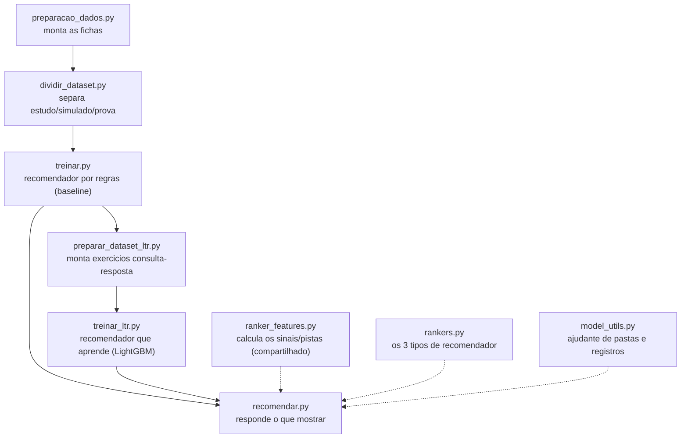

# Treinamento — IA de Recomendação de Posts Fitness

Módulo responsável por treinar e executar a IA de recomendação de posts fitness. Consome os parquets gerados pelo pipeline de extração (`extracao_filtragem/output/`) e produz um modelo híbrido capaz de recomendar posts relevantes a partir de **nomes de tags** e um **timestamp** — sem uso de IDs.

## Estrutura

```
treinamento/
├── preparacao_dados.py     # Etapa 1: processa os parquets e gera features
├── dividir_dataset.py      # Etapa 2: divide os dados em treino/validação/teste
├── treinar.py              # Etapa 3: treina e serializa os artefatos do modelo
├── preparar_dataset_ltr.py # Etapa 3A: monta datasets query-item para LTR
├── treinar_ltr.py          # Etapa 3B: treina o LightGBMRanker
├── recomendar.py           # Etapa 4: inferência — função recomendar() + CLI
├── rankers.py              # Abstração plugável de rankers (baseline/LTR)
├── dados/                  # Artefatos intermediários (gerado automaticamente)
│   ├── posts_metadata.parquet           # Posts com apenas valores semânticos (sem IDs)
│   ├── interacoes_por_tag.parquet       # Popularidade de cada tag por volume de interações
│   ├── social_scores.parquet            # Score de influência social por post (dataset completo)
│   ├── user_tag_profile.parquet         # Perfil usuário-tag (interesses + interações + vizinhos)
│   ├── tag_lista.txt                    # Uma tag fitness por linha (alfabético)
│   ├── event_type_lista.txt             # Tipos de evento únicos (like, create, reply)
│   ├── language_lista.txt               # Idiomas únicos presentes nos posts
│   ├── message_type_lista.txt           # Tipos de mensagem únicos (post, comment)
│   ├── user_id_lista.txt                # IDs de todos os usuários com interações fitness
│   ├── tag_cooccurrence_pares_lista.txt # Pares co-ocorrentes: tag_a|tag_b|count (desc)
│   └── splits/                          # Conjuntos divididos (gerado pelo dividir_dataset.py)
│       ├── train_posts.parquet             # 70% dos posts — usados no treino
│       ├── val_posts.parquet               # 15% dos posts — usados na validação
│       ├── test_posts.parquet              # 15% dos posts — usados no teste final
│       ├── train_interactions.parquet      # Interações dos posts de treino
│       ├── val_interactions.parquet        # Interações dos posts de validação
│       ├── test_interactions.parquet       # Interações dos posts de teste
│       ├── train_tag_cooccurrence.parquet  # Co-ocorrência recalculada só com treino
│       └── train_social_scores.parquet     # Scores sociais recalculados só com treino
├── modelo/                 # Modelo padrão/legado (gerado automaticamente)
│   ├── vectorizer.pkl              # MultiLabelBinarizer ajustado sobre as tags
│   ├── post_matrix.npy             # Matriz (n_posts × n_tags) dos vetores de posts
│   ├── tag_cooccurrence_map.pkl    # Mapa {tag → [(tag_relacionada, peso)]}
│   ├── popularidade.npy            # Score de popularidade normalizado por post
│   ├── social_scores.npy           # Score de influência social normalizado por post
│   ├── posts_cache.parquet         # Catálogo alinhado ao post_matrix
│   └── metadata.json               # Metadata do modelo
└── modelos/                # Um diretório por experimento do benchmark TCC
    └── <model_id>/
        ├── metadata.json
        ├── posts_cache.parquet
        ├── ltr_train.parquet       # Apenas para família LTR
        ├── ltr_val.parquet         # Apenas para família LTR
        ├── ltr_model.txt           # Apenas para família LTR
        └── ltr_feature_schema.json # Apenas para família LTR
```

## Pré-requisitos

```bash
pip install -r requirements.txt   # scikit-learn, pandas, numpy, pyarrow
```

O pipeline de extração deve ter sido executado antes:

```bash
python extracao_filtragem/pipeline.py
```

## Orquestrador interativo

Fluxo recomendado pela raiz do projeto:

```bash
python main.py
```

No menu, escolha `Rodar treinamento` ou `Rodar treinamento + avaliacao`. O
orquestrador executa a sequência padrão
`preparacao_dados.py -> dividir_dataset.py -> treinar.py`, reaproveitando o
contexto salvo em `.pipeline_state.json`.

## Como usar

### Etapa 1 — Preparar os dados

```bash
python treinamento/preparacao_dados.py
```

Lê os parquets de `extracao_filtragem/output/` e gera os artefatos intermediários em `treinamento/dados/`:

- `posts_metadata.parquet` — posts com colunas semânticas (sem `message_id`), com `creation_date_iso` legível
- `interacoes_por_tag.parquet` — contagem de interações por tag (like + create + reply)
- `social_scores.parquet` — score de influência social por post, baseado no grau dos usuários que interagiram
- `user_tag_profile.parquet` — afinidade usuário-tag combinando interesses explícitos, interações recentes e vizinhos no grafo social
- `tag_lista.txt` — uma tag fitness por linha (alfabético)
- `event_type_lista.txt` — tipos de evento únicos (like, create, reply)
- `language_lista.txt` — idiomas únicos presentes nos posts (excluindo nulos)
- `message_type_lista.txt` — tipos de mensagem únicos (post, comment)
- `user_id_lista.txt` — IDs de todos os usuários com pelo menos uma interação fitness
- `tag_cooccurrence_pares_lista.txt` — pares de tags co-ocorrentes no formato `tag_a|tag_b|cooccurrences`, ordenados por frequência decrescente

### Etapa 2 — Dividir o dataset

```bash
python treinamento/dividir_dataset.py
```

Divide os posts aleatoriamente em treino (70%), validação (15%) e teste (15%), e salva os splits em `treinamento/dados/splits/`. As proporções e a seed são configuráveis:

```bash
# Proporções diferentes
python treinamento/dividir_dataset.py --train 0.8 --val 0.1 --test 0.1

# Seed diferente
python treinamento/dividir_dataset.py --seed 123
```

### Etapa 3 — Treinar o modelo

```bash
# Treina usando apenas o conjunto de treino (recomendado)
python treinamento/treinar.py

# Treina usando o dataset completo (para versão final / produção)
python treinamento/treinar.py --dataset-completo
```

Ajusta o vetorizador, calcula a matriz de posts e salva todos os artefatos em `treinamento/modelo/`. Por padrão usa apenas os 70% de posts do split de treino. Exibe um resumo ao final:

```
Resumo dos artefatos:
  - Fonte dos dados      : split de treino
  - vectorizer.pkl       : MultiLabelBinarizer com 55 tags
  - post_matrix.npy      : 472 posts × 55 tags
  - tag_cooccurrence_map : 5 entradas
  - popularidade.npy     : 472 valores
  - social_scores.npy    : 472 valores
  - posts_cache.parquet  : 472 posts alinhados ao post_matrix
  - metadata.json        : parâmetros e rastreabilidade do experimento
```

Para o benchmark do TCC, o fluxo multi-modelo usa o catálogo completo, mas
continua calculando co-ocorrência, popularidade e score social apenas a partir
do split de treino:

```bash
python treinamento/treinar.py --catalogo-completo --model-dir treinamento/modelos/baseline_hibrido_padrao
```

### Benchmark TCC e schema do JSON

O arquivo raiz `casos_uso_tcc.json` descreve um array `modelos`, em que cada
objeto representa um experimento reproduzível. Os campos principais são:

- `id`: identificador estável do experimento
- `enabled`: permite ativar ou desativar sem apagar o caso
- `family`: `baseline_hibrido` ou `ltr_lightgbm`
- `descricao`: texto curto para a tabela comparativa
- `split_config`: proporções e `seed` do split
- `training`: define se o experimento usa `catalogo_completo` ou `dataset_completo`
- `avaliacoes`: liga/desliga `offline`, `manual`, `popularidade` e `otimizacao`
- `top_k`: lista de Ks usados na avaliação comparativa
- `metric_target`: métrica usada para destacar o melhor modelo
- `params`: hiperparâmetros da família
- `notes`: observações livres do experimento

Parâmetros típicos do baseline:

- `w_cos`, `w_cooc`, `w_time`, `w_social`
- `peso_popularidade`
- `usar_pesos_otimos`
- `grid_step`, `random_search`, `max_queries_otimizacao`

Parâmetros típicos do LTR:

- `objective`, `metric_at`
- `num_leaves`, `learning_rate`, `n_estimators`, `min_data_in_leaf`
- `feature_fraction`, `bagging_fraction`, `bagging_freq`
- `seed`

Parâmetros do dataset LTR:

- `features_enabled`
- `negatives_per_query`
- `hard_negative_topn`
- `max_queries_train`
- `max_queries_val`

Fluxo LTR v1:

```bash
python treinamento/treinar.py --catalogo-completo --model-dir treinamento/modelos/ltr_lightgbm_v1
python treinamento/preparar_dataset_ltr.py --model-dir treinamento/modelos/ltr_lightgbm_v1
python treinamento/treinar_ltr.py --model-dir treinamento/modelos/ltr_lightgbm_v1
```

### Etapa 4 — Recomendar posts

**Via CLI:**

```bash
# Listar todas as tags conhecidas pelo modelo
python treinamento/recomendar.py --listar-tags

# Recomendar posts a partir de tags e timestamp
python treinamento/recomendar.py --tags "Born_to_Run,Superunknown" --timestamp 1320000000000

# Recomendar posts personalizados para um usuário
python treinamento/recomendar.py --tags "Born_to_Run,Superunknown" --timestamp 1320000000000 --user-id 123

# Limitar a 5 recomendações personalizadas
python treinamento/recomendar.py --tags "Running_Free" --timestamp 1300000000000 --top-k 5 --user-id 123

# Ajustar o peso de popularidade no score final
python treinamento/recomendar.py --tags "Running_Free" --timestamp 1300000000000 --peso-popularidade 0.20

# Incluir posts com conjunto de tags idêntico à entrada
python treinamento/recomendar.py --tags "Running_Free" --timestamp 1300000000000 --user-id 123 --incluir-exatas
```

**Via Python:**

```python
from treinamento.recomendar import recomendar

df = recomendar(
    tags=["Born_to_Run", "Superunknown"],
    timestamp=1320000000000,
    top_k=10,
    user_id=123,
)
print(df)
```

## Entradas e saídas do modelo

### Entradas


| Parâmetro           | Tipo            | Descrição                                                                                    |
| ------------------- | --------------- | -------------------------------------------------------------------------------------------- |
| `tags`              | `List[str]`     | Nomes das tags do post de referência (valores, não IDs)                                      |
| `timestamp`         | `int`           | Timestamp em milissegundos do post de referência                                             |
| `top_k`             | `int`           | Número de posts recomendados (padrão: 10)                                                    |
| `peso_popularidade` | `float`         | Peso do sinal de popularidade no score padrão/fallback (padrão: 0.10)                        |
| `user_id`           | `Optional[int]` | Identificador do usuário alvo; se houver perfil disponível, ativa recomendação personalizada |


### Saída

DataFrame com os posts mais relevantes — **sem nenhum ID exposto**:


| Coluna              | Descrição                                  |
| ------------------- | ------------------------------------------ |
| `message_type`      | Tipo do post: `post` ou `comment`          |
| `creation_date_iso` | Data de criação no formato ISO 8601        |
| `tags_fitness`      | Lista de tags fitness do post recomendado  |
| `content_length`    | Tamanho do conteúdo em caracteres          |
| `language`          | Idioma detectado                           |
| `relevance_score`   | Score de relevância combinado, entre 0 e 1 |


## Tipo de modelo e algoritmos

### Categoria: Sistema de Recomendação Híbrido Clássico

Este projeto **não usa redes neurais, LLMs nem deep learning**. A IA é um **sistema de recomendação híbrido clássico** que combina técnicas de filtragem baseada em conteúdo (*content-based*) com elementos de filtragem colaborativa (*collaborative filtering*) e sinais de grafo social.

Essa escolha foi intencional: o dataset LDBC SNB fornece metadados ricos (tags, co-ocorrências, grafo social, interações) que permitem construir um recomendador de alta qualidade sem necessidade de modelos parametrizados pesados — com trés grandes vantagens:

- **Determinismo**: o mesmo conjunto de tags + timestamp sempre produz o mesmo resultado
- **Interpretabilidade**: cada componente do score tem significado claro e peso explícito
- **Eficiência**: treino e inferência são rápidos mesmo no dataset sf30 (milhares de posts fitness)

---

### Algoritmos utilizados

#### 1. Vetorização de tags — `MultiLabelBinarizer` (scikit-learn)

O conhécimento do modelo sobre posts começa representando cada post como um **vetor binário de tags**. A biblioteca `scikit-learn` fornece o `MultiLabelBinarizer`, que aprende o vocabulário de tags no conjunto de treino e transforma cada lista de tags num vetor `float32`:

```
post ["Running_Free", "Yoga"] → [0, 0, 1, 0, 1, 0, ...]   (n_tags posições)
```

O resultado é a `post_matrix.npy` de shape `(n_posts, n_tags)` — uma linha por post, uma coluna por tag fitness conhecida. Não há gradiente nem otimização; o "treino" consiste em **ajustar o vocabulário** (`.fit_transform()`) uma única vez.

#### 2. Similaridade de cosseno — filtragem baseada em conteúdo

Para calcular o quão parecido um post do catálogo é com a entrada do usuário, usa-se a **similaridade de cosseno** entre vetores de tags:

```
cosine_sim(A, B) = (A · B) / (‖A‖ × ‖B‖)
```

Um resultado de `1.0` significa tags idênticas; `0.0` significa sem nenhuma tag em comum. Esta é a operação mais importante do modelo (peso 0.40 no modo padrão), pois garante que o conteúdo recomendado seja tematicamente relevante.

#### 3. Co-ocorrência de tags — filtragem colaborativa implícita

A co-ocorrência conta **quantas vezes dois posts compartilham a mesma tag** no conjunto de treino. Pares frequentes indicam que usuários com aquele interesse tendem a se interessar por ambas. Isso funciona como uma forma de filtragem colaborativa sem precisar de IDs de usuários:

```
co-ocorrência("Running_Free", "Born_to_Run") = 142  → peso alto
co-ocorrência("Running_Free", "Yoga")         =   3  → peso baixo
```

O mapa resultante (`tag_cooccurrence_map.pkl`) permite **expandir a busca** além das tags exatas da entrada e surfacar conteúdo que pessoas com gostos parecidos também consomem.

#### 4. Decaimento exponencial — sinal temporal

Posts temporalmente próximos ao timestamp de entrada recebem um fator de boost calculado por:

```
time_decay = exp(−0.01 × Δdias)
```

`Δdias` é a distância absoluta em dias entre o timestamp do post e o da requisição. Posts do mesmo dia ficam próximos de 1.0; posts de 1 ano de distância ficam em ≈ 0.03.

#### 5. Influência social — centralidade de grau no grafo

O grafo social (`user_social_graph.parquet`) conecta usuários por relações de amizade. A **centralidade de grau** de um nó é simplesmente o número de arestas que ele possui — o quanto aquele usuário está conectado.

Para cada post, soma-se o grau de todos os usuários que interagiram com ele. Posts interagidos por usuários altamente conectados (influenciadores) recebem score maior. Esse sinal é pré-computado no treino (`social_scores.npy`) e não requer o ID do usuário em tempo de inferência.

#### 6. Perfil usuário-item — filtragem colaborativa personalizada (modo `--user-id`)

Quando um `user_id` é informado, o modelo busca o **perfil de afinidade** desse usuário (`user_tag_profile.parquet`), que agrega:

- **Interesses declarados**: tags que o usuário segue explicitamente no perfil LDBC
- **Interações recentes**: tags de posts que o usuário curtiu/comentou, com decaimento temporal
- **Sinais dos vizinhos sociais**: média ponderada dos interesses dos amigos diretos no grafo

O score de afinidade é mapeado sobre cada post do catálogo e substitui o sinal de popularidade, gerando recomendações **personalizadas** sem armazenar histórico individual em tempo de inferência.

---

### O que acontece durante o "treinamento"

Ao contrário de redes neurais (que minimizam uma função de perda via gradiente), o treino aqui é um processo de **computação e serialização de estruturas de dados**:

```
treinar.py
  ├─ fit(MultiLabelBinarizer)  → aprende o vocabulário de tags (sem gradiente)
  ├─ transform(posts)          → gera post_matrix.npy (vetorização binária)
  ├─ count(co-ocorrências)     → gera tag_cooccurrence_map.pkl
  ├─ sum(interações por tag)   → gera popularidade.npy
  └─ sum(graus × interações)   → gera social_scores.npy
```

Não há épocas, taxa de aprendizado nem função de perda. A "inteligência" do modelo vem das **estatísticas extraídas do comportamento real dos usuários** no dataset LDBC SNB.

## Arquitetura do modelo

O score de relevância é calculado combinando cinco sinais no modo padrão e
cinco no modo personalizado (`user_id` com perfil disponível). No modo
personalizado, a afinidade usuário-item substitui o sinal de popularidade.

```
score_padrao = (
    0.40 × cosine_sim
    + 0.25 × cooccurrence_boost
    + 0.15 × time_decay
    + 0.20 × social_influence
    + peso_popularidade × popularity_signal
) / (1.00 + peso_popularidade)

score_personalizado = (
    0.30 × cosine_sim
    + 0.20 × cooccurrence_boost
    + 0.15 × time_decay
    + 0.15 × social_influence
    + 0.20 × user_item_affinity
)
```


| Sinal                        | Peso (padrão)       | Peso (personalizado) | Como funciona                                                                                                                                                               |
| ---------------------------- | ------------------- | -------------------- | --------------------------------------------------------------------------------------------------------------------------------------------------------------------------- |
| **Similaridade de conteúdo** | 0.40                | 0.30                 | Coseno entre o vetor de tags da entrada e o de cada post. Posts com as mesmas tags recebem score máximo.                                                                    |
| **Co-ocorrência de tags**    | 0.25                | 0.20                 | Expande as tags de entrada com tags relacionadas (do `tag_cooccurrence.parquet`) e aplica boost nos posts que as contêm. Descobre conteúdo relacionado mesmo sem tag exata. |
| **Recência relativa**        | 0.15                | 0.15                 | Decaimento exponencial `exp(-0.01 × Δdias)` pela distância em dias entre o timestamp de entrada e o do post.                                                                |
| **Influência social**        | 0.20                | 0.15                 | Soma do grau (número de conexões no grafo social) dos usuários que interagiram com cada post.                                                                               |
| **Popularidade**             | 0.10 (configurável) | -                    | Intensidade histórica de interações nas tags do post (`popularidade.npy`). Pode ser ajustada no CLI/API com `peso_popularidade`.                                            |
| **Afinidade usuário-item**   | -                   | 0.20                 | Score médio das tags do post no perfil do usuário, que agrega interesses explícitos, interações recentes (com decaimento temporal) e sinais dos vizinhos sociais.           |


### Exemplo de co-ocorrência

Se a entrada for `["Young_Hearts_Run_Free"]` e o mapa de co-ocorrência indicar que essa tag aparece junto de `Superunknown` e `Run_with_the_Pack`, então posts com essas tags relacionadas também recebem boost — mesmo sem conter a tag exata da entrada.

## Fluxo completo

```
extracao_filtragem/pipeline.py
        ↓ gera parquets em output/
treinamento/preparacao_dados.py
        ↓ gera dados/ com features processadas
treinamento/dividir_dataset.py
        ↓ gera dados/splits/ com treino/validação/teste
treinamento/treinar.py
        ↓ gera modelo/ com artefatos serializados (usa split de treino)
treinamento/recomendar.py
        ↓ carrega modelo e retorna recomendações
```

---

## Conceitos essenciais

Esta seção explica em linguagem simples o que acontece por baixo dos panos. Qualquer pessoa deve conseguir entender.

### O que são treino, validação e teste?

Imagine que você está estudando para uma prova:

- **Treino (70%)** é o material de estudo — o modelo aprende os padrões com esses dados. É o maior conjunto porque quanto mais exemplos, melhor o aprendizado.
- **Validação (15%)** é o simulado — depois de estudar, você pratica com questões que ainda não viu para verificar se está indo bem. Aqui ajustamos parâmetros do modelo (como os pesos do score).
- **Teste (15%)** é a prova final — usada uma única vez, no final, para medir o desempenho real. Se você usar esses dados durante o desenvolvimento, é como ver as respostas antes da prova: o resultado será inflado e não refletirá o mundo real.


| Conjunto  | Proporção | Uso                                               |
| --------- | --------- | ------------------------------------------------- |
| Treino    | 70%       | O modelo aprende com esses posts                  |
| Validação | 15%       | Avalia durante o desenvolvimento; permite ajustes |
| Teste     | 15%       | Avaliação final — usada só uma vez                |


### O que é seed?

Seed é um número que controla como o embaralhamento aleatório é feito. Com a mesma seed, o embaralhamento sempre produz o mesmo resultado — ou seja, os mesmos posts vão para treino, validação e teste, toda vez que você rodar o script.

Isso é importante para **reprodutibilidade**: qualquer pessoa que rodar o script com `--seed 42` obterá exatamente a mesma divisão.

Mudar a seed muda quais posts vão para cada grupo — o que pode ser útil para validar que os resultados não dependem de uma divisão específica.

```bash
python treinamento/dividir_dataset.py --seed 42   # divisão padrão (reproduzível)
python treinamento/dividir_dataset.py --seed 99   # divisão diferente
```

### O que é data leakage?

Data leakage ("vazamento de dados") acontece quando o modelo aprende informações do conjunto de teste durante o treinamento. Isso faz com que o modelo pareça melhor do que realmente é.

Neste projeto, tanto o `tag_cooccurrence` (relações entre tags) quanto o `social_scores` (influência do grafo social) são **recalculados usando apenas os posts de treino**. Se fossem calculados com todos os dados, o modelo aprenderia padrões que existem apenas nos posts de teste — o que seria trapacear.

```bash
# Gerados APENAS com dados de treino (sem leakage)
train_tag_cooccurrence.parquet
train_social_scores.parquet
```

### Como funciona a divisão por percentual?

Os percentuais são aplicados sobre o total de posts do dataset. Isso significa que o script funciona para qualquer tamanho de dataset, do menor (sf0.1, 674 posts) ao maior (sf30, milhões de posts):

```
n_validação = int(total × 0.15)
n_teste     = int(total × 0.15)
n_treino    = total − n_validação − n_teste  ← absorve qualquer arredondamento
```

Nenhum registro é perdido: o arredondamento vai sempre para o treino.

### Os sinais do score de relevância

Quando você pede uma recomendação, o modelo combina cinco sinais. No modo
personalizado (`user_id` com perfil disponível), a afinidade usuário-item
substitui a popularidade. Se não houver perfil para o usuário informado, o
sistema faz fallback para o score padrão.

```
score_padrao = (
    0.40 × similaridade_conteudo
    + 0.25 × boost_coocorrencia
    + 0.15 × fator_recencia
    + 0.20 × influencia_social
    + peso_popularidade × sinal_popularidade
) / (1.00 + peso_popularidade)

score_personalizado = (
    0.30 × similaridade_conteudo
    + 0.20 × boost_coocorrencia
    + 0.15 × fator_recencia
    + 0.15 × influencia_social
    + 0.20 × afinidade_usuario_item
)
```

**1. Similaridade de conteúdo (0.40 no padrão / 0.30 no personalizado)**

Compara matematicamente as tags do post de entrada com as tags de cada post do
catálogo. Usa similaridade de cosseno: posts com as mesmas tags recebem score
1.0; posts sem nenhuma tag em comum recebem 0.0.

**2. Boost de co-ocorrência (0.25 no padrão / 0.20 no personalizado)**

Expande a busca além das tags exatas. Se `Young_Hearts_Run_Free` costuma
aparecer junto de `Superunknown`, então posts com essa tag relacionada também
recebem boost proporcional ao número de co-ocorrências.

**3. Fator de recência (0.15 em ambos os modos)**

Posts temporalmente próximos ao timestamp de entrada recebem pontuação maior. O
decaimento segue a fórmula `exp(-0.01 × Δdias)`: posts do mesmo dia têm fator
próximo de 1.0; posts muito distantes no tempo perdem força.

**4. Influência social (0.20 no padrão / 0.15 no personalizado)**

Cada usuário tem um **grau** no grafo social: o número de amigos que possui.
Quando usuários altamente conectados interagem com um post, esse post tende a
receber score maior.

**5. Popularidade (0.10 configurável no modo padrão/fallback)**

Mede a intensidade histórica de interações nas tags do post
(`popularidade.npy`). Esse peso pode ser ajustado no CLI/API com
`peso_popularidade`.

**6. Afinidade usuário-item (0.20 no modo personalizado)**

Resume o quanto as tags do post combinam com o perfil do usuário, agregando
interesses explícitos, interações recentes com decaimento temporal e sinais
sociais dos vizinhos no grafo.


| Sinal                    | Peso (padrão)       | Peso (personalizado) | O que prioriza                            |
| ------------------------ | ------------------- | -------------------- | ----------------------------------------- |
| Similaridade de conteúdo | 0.40                | 0.30                 | Posts com as mesmas tags                  |
| Co-ocorrência de tags    | 0.25                | 0.20                 | Posts com tags relacionadas               |
| Recência relativa        | 0.15                | 0.15                 | Posts temporalmente próximos              |
| Influência social        | 0.20                | 0.15                 | Posts interagidos por usuários influentes |
| Popularidade             | 0.10 (configurável) | -                    | Tags historicamente mais engajadas        |
| Afinidade usuário-item   | -                   | 0.20                 | Tags mais aderentes ao perfil do usuário  |


---

## Explicação dos códigos (para leigos)

> Esta seção explica, arquivo por arquivo, **o que cada programa faz, como funciona e por que existe** — em linguagem simples, para quem não programa. As seções acima já explicaram os conceitos de IA; aqui o foco é "o que cada arquivo `.py` faz na prática". Termos técnicos estão no **Glossário** ao final.

### A ideia geral em uma frase

Pense neste módulo como uma **escola de cozinheiros recomendadores**. Os ingredientes organizados (vindos da extração) são transformados em "fichas de aprendizado", o material é separado em "estudo", "simulado" e "prova", e então construímos dois tipos de "recomendadores": um baseado em **regras com pesos** (o *baseline*) e outro que **aprende sozinho a ordenar** (o *LTR*). No fim, um programa usa esses recomendadores para responder "quais posts mostrar?".




---

### `preparacao_dados.py` — monta as "fichas" de cada post e usuário

**O que faz:** lê os arquivos organizados da extração e calcula informações derivadas úteis para recomendar.

**Como funciona, passo a passo:**

1. Carrega os seis arquivos `.parquet` da extração (posts, tags, interações, interesses, amizades, co-ocorrência).
2. Monta a **ficha de cada post** (`posts_metadata.parquet`): converte a data de um número para um formato legível e guarda as tags de cada post.
3. Calcula a **popularidade de cada tag** (`interacoes_por_tag.parquet`): conta quantas interações cada tag recebeu — tags mais "movimentadas" são mais populares.
4. Calcula a **influência social de cada post** (`social_scores.parquet`): para cada post, soma o "grau" (número de amizades) de cada pessoa que interagiu com ele. Posts tocados por gente muito conectada (influenciadores) ganham nota maior. No fim, normaliza tudo para uma escala de 0 a 1.
5. Constrói o **perfil de cada usuário** (`user_tag_profile.parquet`): combina três coisas — (a) tags que a pessoa **declara** seguir, (b) tags de posts que ela **curtiu/comentou recentemente** (com peso maior para o que é mais recente, via *decaimento exponencial*) e (c) os **gostos dos amigos** dela. Isso vira um número de "afinidade" entre cada usuário e cada tag.
6. Salva listas auxiliares em `.txt` (lista de tags, de idiomas, de tipos de evento, etc.) e um **manifesto** registrando o que foi gerado.

**Por que usar:** o modelo não consegue recomendar direto dos dados crus. Este programa **pré-calcula as "pistas"** (popularidade, influência, perfil) uma vez, para que recomendar depois seja rápido.

---

### `dividir_dataset.py` — separa "estudo", "simulado" e "prova"

**O que faz:** divide os dados em três grupos — treino (estudo), validação (simulado) e teste (prova final) — para conseguirmos medir de forma honesta se o modelo é bom. (A seção [Conceitos essenciais](#conceitos-essenciais) explica essa analogia em detalhe.)

**Como funciona — há três jeitos (estratégias) de cortar:**

1. `**temporal_global` (recomendado):** coloca **todas as interações em ordem de tempo** e corta cronologicamente: o passado vira treino, o meio vira validação e o futuro vira teste. É o mais justo, porque imita a vida real — o modelo aprende com o passado e é testado no futuro, **nunca "vendo o futuro" antes da hora**.
2. `**leave_last_k`:** para **cada usuário**, separa as últimas K interações dele para a prova, as K anteriores para o simulado e o resto para estudo. Útil quando queremos avaliar "o próximo passo de cada pessoa".
3. `**random` (antigo):** embaralha os posts ao acaso e corta em 70/15/15. Simples, mas **não respeita o tempo**, então é menos realista (mantido só por compatibilidade).

Além de cortar, o programa **recalcula** duas pistas usando **apenas os dados de treino**: a co-ocorrência de tags e os scores sociais. Isso evita o **vazamento de dados** (*data leakage*) — ou seja, evita que o modelo "cole" usando informação que só deveria aparecer na prova.

**Por que usar:** sem separar estudo de prova, o modelo poderia parecer ótimo só porque "decorou as respostas". Esta divisão garante uma avaliação confiável.

---

### `treinar.py` — constrói o recomendador "por regras com pesos" (baseline)

**O que faz:** cria o modelo principal (chamado *baseline híbrido*) e salva todas as "peças" dele no disco. Importante: aqui **não há aprendizado por tentativa e erro** como em redes neurais — o "treino" é, na verdade, **calcular e guardar estruturas de dados** (a seção ["O que acontece durante o treinamento"](#o-que-acontece-durante-o-treinamento) detalha isso).

**Como funciona, passo a passo:**

1. Carrega o catálogo de posts (por padrão, só os de treino).
2. **Vetoriza as tags** com o `MultiLabelBinarizer`: transforma a lista de tags de cada post numa "ficha de presença" (um vetor de 0s e 1s indicando quais tags ele tem). O conjunto de todas as fichas vira a `post_matrix.npy`.
  - Aqui ele também mede a **cobertura do vocabulário**: quantas tags aparecem que o modelo **não conhece** (as chamadas **OOV**, "fora do vocabulário").
3. Monta o **mapa de co-ocorrência** (quais tags costumam aparecer juntas), com pesos normalizados.
4. Calcula a **popularidade** e os **scores sociais** de cada post, alinhados ao catálogo.
5. (Opcional) Gera **embeddings semânticos** das tags com um modelo de linguagem pré-treinado (`sentence-transformers`) — uma forma de capturar que "corrida" e "maratona" são *parecidas* mesmo sendo tags diferentes. Se a biblioteca não estiver instalada, ele simplesmente pula essa parte.
6. **Serializa (salva) tudo:** o vetorizador (`.pkl`), as matrizes e scores (`.npy`), o catálogo (`posts_cache.parquet`) e um `metadata.json` com toda a "ficha técnica" do experimento (incluindo de qual dataset veio).

**Por que usar:** este é o cérebro padrão do sistema. Ele é **determinístico** (mesma entrada → mesma resposta), **interpretável** (dá para explicar cada nota) e **rápido**.

---

### `preparar_dataset_ltr.py` — monta os "exercícios" para o modelo que aprende a ordenar

**O que faz:** prepara os dados de treino para o segundo tipo de modelo, o **LTR** (*Learning to Rank*, "aprender a ordenar"). Em vez de regras com pesos fixos, esse modelo vai **aprender sozinho** a melhor forma de combinar as pistas.

**Como funciona, passo a passo:**

1. Para cada usuário, pega uma interação como **"consulta de referência"** (ex.: "essa pessoa interagiu com este post") e considera as interações **seguintes** dela como as **"respostas certas"** (os *positivos*).
2. Para cada consulta, calcula as **pistas (features)** de **todos** os posts candidatos.
3. Separa os candidatos em **positivos** (o que a pessoa realmente consumiu depois) e **negativos** (o resto).
4. Entre os negativos, escolhe os **"negativos difíceis"** (*hard negatives*): aqueles que o modelo simples (*baseline*) acharia muito bons, mas que **não** foram a resposta certa. Treinar com exemplos difíceis força o modelo a ficar mais esperto. Também sorteia alguns negativos comuns.
5. Cada par "consulta + candidato" vira **uma linha** com suas pistas e um **rótulo** (1 = resposta certa, 0 = errada). Salva tudo em `ltr_train.parquet` e `ltr_val.parquet`.

**Por que usar:** modelos que aprendem a ordenar precisam de **exemplos rotulados** ("isto era certo, aquilo era errado"). Este programa cria esses exemplos de forma cuidadosa, inclusive com casos difíceis.

---

### `treinar_ltr.py` — treina o modelo que aprende a ordenar (LightGBM)

**O que faz:** usa os "exercícios" do passo anterior para treinar um modelo **LightGBM** no modo de ranking (ordenação).

**Como funciona, passo a passo:**

1. Carrega os exercícios (treino e validação) e confere se foram feitos com a **mesma divisão** de dados do modelo base (senão, para — para evitar comparar coisas diferentes).
2. Agrupa as linhas por **consulta** (o LightGBM precisa saber quais candidatos pertencem à mesma pergunta).
3. Treina usando **LambdaRank**, um método focado em **acertar a ordem** dos primeiros resultados, otimizando a métrica **NDCG** (qualidade do ranking — explicada no README de avaliação).
4. Usa **parada antecipada** (*early stopping*): se o desempenho na validação para de melhorar, ele interrompe o treino para não desperdiçar tempo nem "decorar".
5. Salva o modelo (`ltr_model.txt`), um relatório de **importância das features** (quais pistas mais pesaram) e a "ficha técnica" no metadata.

**Por que usar:** é a alternativa mais sofisticada ao baseline. Em vez de nós escolhermos os pesos na mão, o LightGBM **descobre sozinho** a melhor combinação das pistas a partir dos exemplos.

---

### `ranker_features.py` — a "central de pistas" (features)

**O que faz:** é o coração compartilhado que **calcula cada sinal/pista** usado por todos os modelos. Tanto o baseline quanto o LTR e a recomendação chamam funções daqui.

**Como funciona:** carrega as peças salvas pelo `treinar.py` e oferece funções para calcular, para cada post do catálogo:

- **similaridade de cosseno** (o quanto as tags batem),
- **boost de co-ocorrência** (tags relacionadas),
- **decaimento temporal** (proximidade no tempo),
- **influência social**, **popularidade** e **afinidade do usuário**,
- além de pistas extras para o LTR, como **Jaccard** (porcentagem de tags em comum), número de tags, tamanho do conteúdo, idioma, etc.

Também identifica as tags **OOV** (que o modelo não conhece) e, juntando tudo, monta a "tabela de pistas" (`build_feature_frame`) que alimenta os modelos.

**Por que usar:** evita repetir conta. Como todas as etapas precisam dos mesmos sinais, centralizá-los aqui garante que o treino e a recomendação usem **exatamente a mesma matemática**.

---

### `rankers.py` — os três tipos de recomendador

**O que faz:** define três "motores" de recomendação que podem ser usados de forma intercambiável:

1. `**WeightedHybridRanker` (baseline híbrido):** combina os sinais com **pesos** (0.40 cosseno, 0.25 co-ocorrência, etc.). Se um `user_id` com perfil é informado, troca o sinal de popularidade pela **afinidade do usuário** (modo personalizado). No fim, "apara" a nota para o intervalo de 0 a 1.
2. `**LightGBMLTRRanker` (LTR):** usa o modelo LightGBM treinado para dar as notas, em vez de pesos fixos.
3. `**PopularityRanker` (popularidade pura):** o recomendador mais "burro" possível — **ignora a consulta** e só devolve os posts mais populares. Serve de **régua mínima**: se um modelo sofisticado não vence esse, algo está errado.

Há ainda a função `load_ranker`, que **detecta automaticamente** qual motor carregar olhando a "ficha técnica" (`metadata.json`) do modelo.

**Por que usar:** padroniza a forma de pedir recomendações. Quem chama não precisa saber se por baixo é baseline, LTR ou popularidade — todos respondem do mesmo jeito.

---

### `recomendar.py` — o "balcão de atendimento"

**O que faz:** é a porta de entrada para pedir recomendações, tanto por programação (`recomendar(...)`) quanto pela linha de comando (CLI).

**Como funciona:** recebe as tags, o timestamp e, opcionalmente, o `user_id`; carrega o motor certo (com **cache**, para não recarregar o mesmo modelo toda hora) e devolve uma tabela com os melhores posts e suas notas. Pela linha de comando, também permite **listar todas as tags** que o modelo conhece.

**Por que usar:** é a interface simples e estável que o resto do projeto (e o simulador) usa para obter recomendações, escondendo toda a complexidade interna.

---

### `model_utils.py` — o "ajudante de organização"

**O que faz:** funções utilitárias para lidar com **pastas de modelos** e o arquivo `metadata.json` (a ficha técnica de cada modelo).

**Como funciona:** resolve caminhos de pasta, lê/atualiza o `metadata.json` (mesclando informações sem perder o que já existia) e **descobre a família** de um modelo (baseline, LTR ou popularidade) olhando os arquivos presentes.

**Por que usar:** mantém a organização e a **rastreabilidade** (saber sempre de onde cada modelo veio e como foi feito), sem repetir esse código em todo lugar.

---

## Glossário de termos (treinamento)

Em ordem alfabética, com analogias do dia a dia.

- **Artefato:** qualquer **arquivo gerado** pelo treino (o vetorizador, as matrizes, o catálogo...). São as "peças" prontas do modelo.
- **Baseline:** o modelo **de referência**, mais simples. Serve de ponto de comparação ("o novo modelo é melhor que o baseline?").
- **Cache (de modelos):** guardar o modelo **já carregado na memória** para não ter que lê-lo do disco toda vez. Por isso a primeira recomendação demora e as seguintes são instantâneas.
- **Catálogo:** a **lista de todos os posts** que podem ser recomendados.
- **Centralidade de grau:** o **número de amizades** de uma pessoa no grafo social. Mais amizades = mais "central"/influente.
- **Co-ocorrência:** duas tags que **aparecem juntas** com frequência (ex.: "corrida" e "maratona"). Sinaliza relação entre temas.
- **Decaimento exponencial:** uma forma de **dar menos peso ao que é antigo**. Quanto mais velho o evento, menor sua importância — caindo rápido no começo e devagar depois. Fórmula usada: `exp(-λ × dias)`.
- **Determinístico:** dá **sempre o mesmo resultado** para a mesma entrada (sem aleatoriedade). Bom para reproduzir e confiar.
- **Embedding (semântico):** transformar uma palavra/tag num **vetor de números** que captura seu *significado*. Tags com sentidos parecidos ficam com vetores próximos, mesmo sem texto igual.
- **Feature (pista/característica):** cada **número que descreve** um candidato em relação à consulta (similaridade, recência, popularidade...). São as "pistas" que o modelo usa para decidir.
- **Grafo social:** o **mapa de amizades** (quem conhece quem).
- **Hard negative (negativo difícil):** um exemplo **errado, mas que parece certo**. Treinar com esses casos "pegadinha" deixa o modelo mais preciso.
- **Híbrido:** que **combina várias técnicas** ao mesmo tempo (conteúdo + social + tempo + popularidade), em vez de usar só uma.
- **Jaccard (índice de):** uma medida de **semelhança entre dois conjuntos** = (itens em comum) ÷ (total de itens distintos). Ex.: tags {A,B} e {B,C} têm Jaccard 1/3.
- **LambdaRank:** o método de treino do LightGBM voltado a **acertar a ordem** dos primeiros resultados (e não apenas dizer "certo/errado").
- **LightGBM:** uma biblioteca de **aprendizado de máquina** baseada em "árvores de decisão" reunidas em conjunto. Aqui, usada no modo de **ordenação** (ranking).
- **LTR (Learning to Rank):** "**aprender a ordenar**". Em vez de pesos definidos por humanos, o modelo **aprende sozinho**, a partir de exemplos, a melhor forma de classificar os candidatos.
- **MultiLabelBinarizer:** ferramenta que transforma uma **lista de tags** numa **"ficha de presença"** (vetor de 0s e 1s). É como marcar caixinhas: 1 onde a tag está presente, 0 onde está ausente.
- **Normalizar:** colocar valores numa **escala comum** (geralmente de 0 a 1), para que sinais diferentes possam ser somados de forma justa.
- `**.npy`:** formato de arquivo do NumPy para guardar **matrizes/vetores de números** de forma compacta.
- **OOV (out-of-vocabulary):** uma tag **"fora do vocabulário"** — que o modelo **nunca viu** no treino e, portanto, não sabe pontuar. (Ex.: digitar "Pizza" num modelo que só conhece tags fitness.)
- **Parada antecipada (early stopping):** **interromper o treino** quando ele para de melhorar, para economizar tempo e evitar "decorar" demais.
- **Personalizado (modo):** quando informamos um `user_id` com perfil e a recomendação passa a considerar **os gostos daquela pessoa** especificamente.
- `**.pkl` (pickle):** formato do Python para **salvar um objeto inteiro** em arquivo (aqui, o vetorizador e o mapa de co-ocorrência), para recarregar depois exatamente como estava.
- **Ranker (recomendador/ordenador):** o **motor que ordena** os posts do mais para o menos relevante.
- **Score / relevance_score:** a **nota de relevância** (de 0 a 1) que o modelo dá a cada post. Quanto maior, mais recomendado.
- **Seed:** um número que **fixa a aleatoriedade**. Com a mesma seed, sorteios e divisões saem **iguais toda vez** (reprodutibilidade).
- **Serializar:** **salvar em arquivo** algo que estava na memória, para poder usar depois.
- **Similaridade de cosseno:** uma forma de medir **o quanto duas "fichas de tags" se parecem**. Vai de 0 (nada em comum) a 1 (idênticas).
- **Split:** a **divisão** dos dados em treino/validação/teste.
- **Vetorização:** transformar informação (como uma lista de tags) em uma **sequência de números** que o computador consegue calcular.
- **Vazamento de dados (data leakage):** quando o modelo **"cola"**, aprendendo sem querer informações que só deveriam aparecer na prova. Inflaria os resultados de forma enganosa.
- **Vocabulário:** o **conjunto de todas as tags** que o modelo conhece (aprendido no treino).

